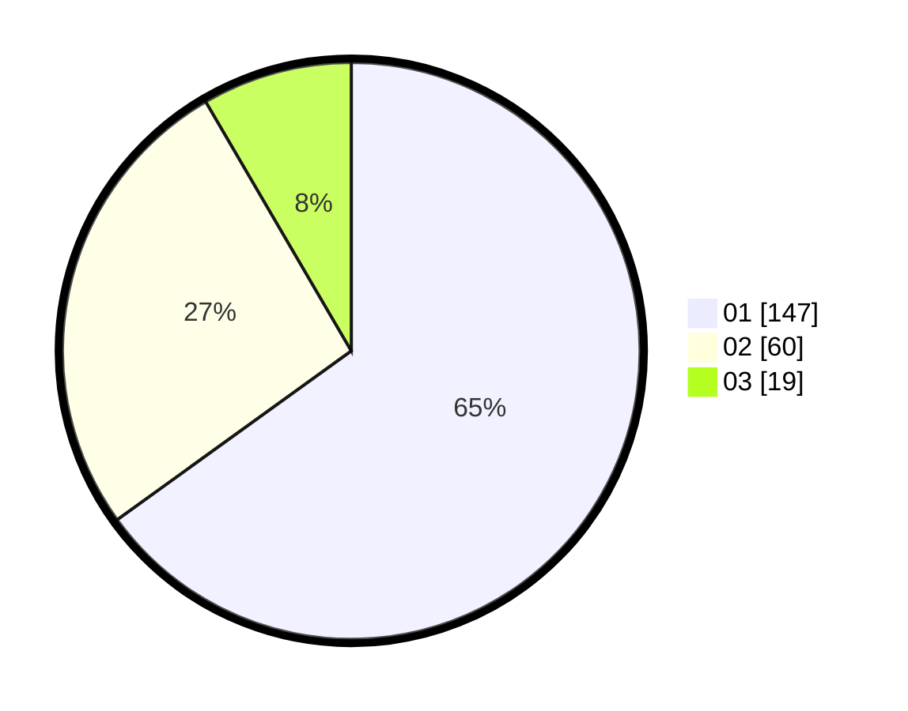

# Hasil

Hasil perolehan suara paslon dapat dilihat pada file paslon-01.txt, paslon-02.txt, dan paslon-03.txt.

Jika tidak ada, artinya data tersebut belum ada pada SIREKAP.

## Perolehan Suara

 * Paslon 01: **147**.
 * Paslon 02: **60**.
 * Paslon 03: **19**.

## Foto C Plano

https://sirekap-obj-formc.kpu.go.id/f57d/pemilu/ppwp/31/75/03/10/05/3175031005034-20240214-200908--6121c0be-2dad-4e5e-81e0-db6ea913c43a.jpg

https://sirekap-obj-formc.kpu.go.id/f57d/pemilu/ppwp/31/75/03/10/05/3175031005034-20240214-200925--fd01034b-c610-4330-bd40-6a9a79add16e.jpg

https://sirekap-obj-formc.kpu.go.id/f57d/pemilu/ppwp/31/75/03/10/05/3175031005034-20240214-212140--b3614ee4-4e63-4749-abf4-6cd26d75fa9c.jpg

## DATA PEMILIH TETAP

Jumlah pemilih dalam DPT: **274**.
 * L: **134**.
 * P: **140**.

## DATA PENGGUNA HAK PILIH

Jumlah pengguna hak pilih dalam DPT: **228**.
 * L: **103**.
 * P: **125**.

Jumlah pengguna hak pilih dalam DPTb: **0**.
 * L: **0**.
 * P: **0**.

Jumlah pengguna hak pilih dalam DPK: **2**.
 * L: **1**.
 * P: **1**.

Jumlah pengguna hak pilih: **230**.
 * L: **104**.
 * P: **126**.

## JUMLAH SUARA SAH DAN TIDAK SAH

JUMLAH SELURUH SUARA SAH: **226**.

JUMLAH SUARA TIDAK SAH: **4**.

JUMLAH SELURUH SUARA SAH DAN SUARA TIDAK SAH: **230**.
