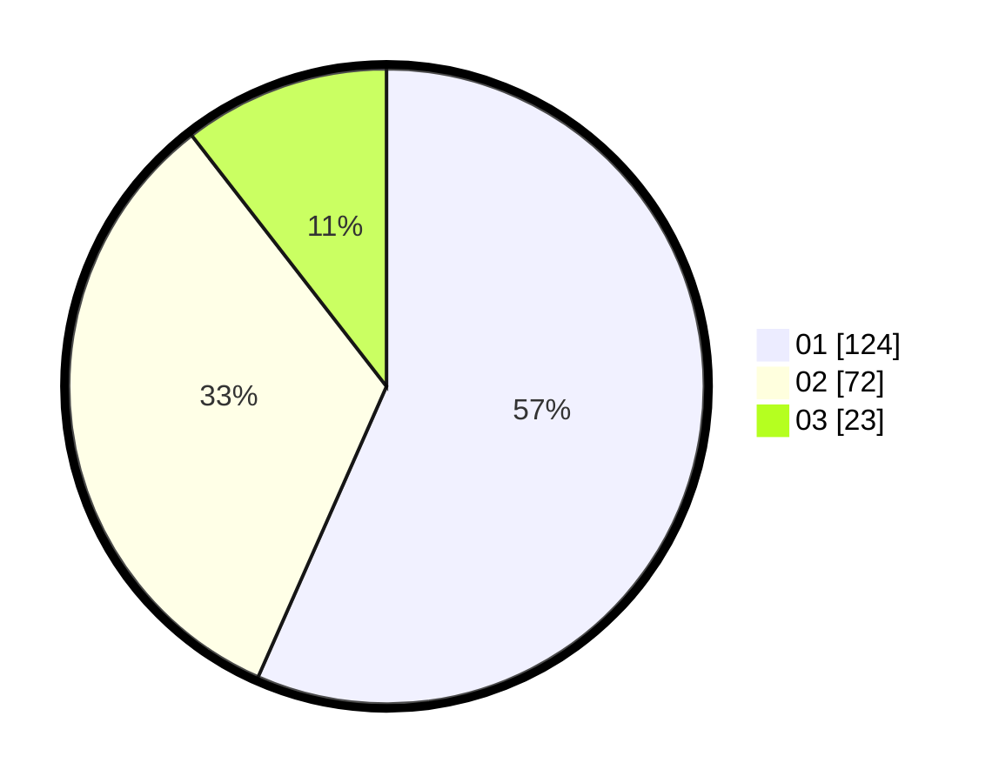

# Hasil

Hasil perolehan suara paslon dapat dilihat pada file paslon-01.txt, paslon-02.txt, dan paslon-03.txt.

Jika tidak ada, artinya data tersebut belum ada pada SIREKAP.

## Perolehan Suara

 * Paslon 01: **124**.
 * Paslon 02: **72**.
 * Paslon 03: **23**.

## Foto C Plano

https://sirekap-obj-formc.kpu.go.id/6055/pemilu/ppwp/31/75/03/10/05/3175031005035-20240214-185802--44c660b8-0376-447d-a0e0-dc664c34e50c.jpg

https://sirekap-obj-formc.kpu.go.id/6055/pemilu/ppwp/31/75/03/10/05/3175031005035-20240214-190835--d6b0802c-9841-4c85-8778-37a72adfc5c1.jpg

https://sirekap-obj-formc.kpu.go.id/6055/pemilu/ppwp/31/75/03/10/05/3175031005035-20240214-191822--1d3c4e75-600a-416d-9c7e-9b3c43a12ec7.jpg

## DATA PEMILIH TETAP

Jumlah pemilih dalam DPT: **281**.
 * L: **140**.
 * P: **141**.

## DATA PENGGUNA HAK PILIH

Jumlah pengguna hak pilih dalam DPT: **221**.
 * L: **104**.
 * P: **117**.

Jumlah pengguna hak pilih dalam DPTb: **0**.
 * L: **0**.
 * P: **0**.

Jumlah pengguna hak pilih dalam DPK: **0**.
 * L: **0**.
 * P: **0**.

Jumlah pengguna hak pilih: **221**.
 * L: **104**.
 * P: **117**.

## JUMLAH SUARA SAH DAN TIDAK SAH

JUMLAH SELURUH SUARA SAH: **219**.

JUMLAH SUARA TIDAK SAH: **2**.

JUMLAH SELURUH SUARA SAH DAN SUARA TIDAK SAH: **221**.
