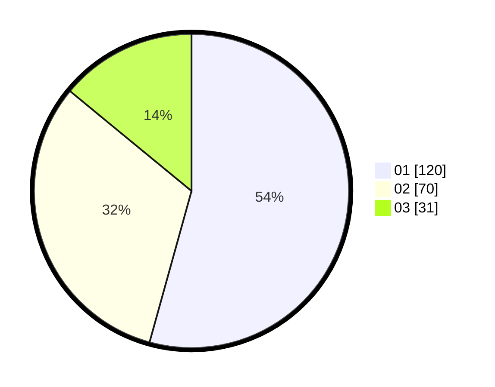

# Hasil

Hasil perolehan suara paslon dapat dilihat pada file paslon-01.txt, paslon-02.txt, dan paslon-03.txt.

Jika tidak ada, artinya data tersebut belum ada pada SIREKAP.

## Perolehan Suara

 * Paslon 01: **120**.
 * Paslon 02: **70**.
 * Paslon 03: **31**.

## Foto C Plano

https://sirekap-obj-formc.kpu.go.id/5eb1/pemilu/ppwp/31/75/03/10/05/3175031005036-20240215-181930--04ca1931-ab57-4dac-92f7-af680ae81048.jpg

https://sirekap-obj-formc.kpu.go.id/5eb1/pemilu/ppwp/31/75/03/10/05/3175031005036-20240215-181627--5183807f-b9e1-48ef-a613-0f838b9b7e36.jpg

https://sirekap-obj-formc.kpu.go.id/5eb1/pemilu/ppwp/31/75/03/10/05/3175031005036-20240215-181726--f0ec4ab2-e98e-4a48-b32d-aae88ee4aa0a.jpg
