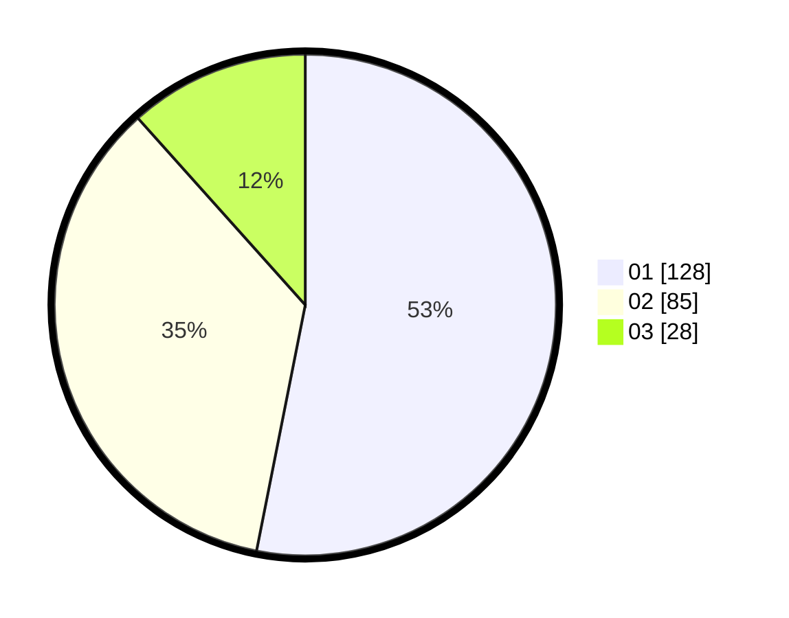

# Hasil

Hasil perolehan suara paslon dapat dilihat pada file paslon-01.txt, paslon-02.txt, dan paslon-03.txt.

Jika tidak ada, artinya data tersebut belum ada pada SIREKAP.

## Perolehan Suara

 * Paslon 01: **128**.
 * Paslon 02: **85**.
 * Paslon 03: **28**.

## Foto C Plano

https://sirekap-obj-formc.kpu.go.id/1eb6/pemilu/ppwp/31/75/03/10/05/3175031005040-20240216-054801--4ed44314-a612-4275-9542-d3d5951b1679.jpg

https://sirekap-obj-formc.kpu.go.id/1eb6/pemilu/ppwp/31/75/03/10/05/3175031005040-20240216-054806--4caf8288-6ca6-4c11-8a9d-4a01ec5d4158.jpg

https://sirekap-obj-formc.kpu.go.id/1eb6/pemilu/ppwp/31/75/03/10/05/3175031005040-20240216-054802--a252c833-7146-4f67-bd32-fb8ce8619e63.jpg

## DATA PEMILIH TETAP

Jumlah pemilih dalam DPT: **283**.
 * L: **144**.
 * P: **139**.

## DATA PENGGUNA HAK PILIH

Jumlah pengguna hak pilih dalam DPT: **240**.
 * L: **119**.
 * P: **121**.

Jumlah pengguna hak pilih dalam DPTb: **0**.
 * L: **0**.
 * P: **0**.

Jumlah pengguna hak pilih dalam DPK: **4**.
 * L: **2**.
 * P: **2**.

Jumlah pengguna hak pilih: **244**.
 * L: **121**.
 * P: **123**.

## JUMLAH SUARA SAH DAN TIDAK SAH

JUMLAH SELURUH SUARA SAH: **241**.

JUMLAH SUARA TIDAK SAH: **3**.

JUMLAH SELURUH SUARA SAH DAN SUARA TIDAK SAH: **244**.
