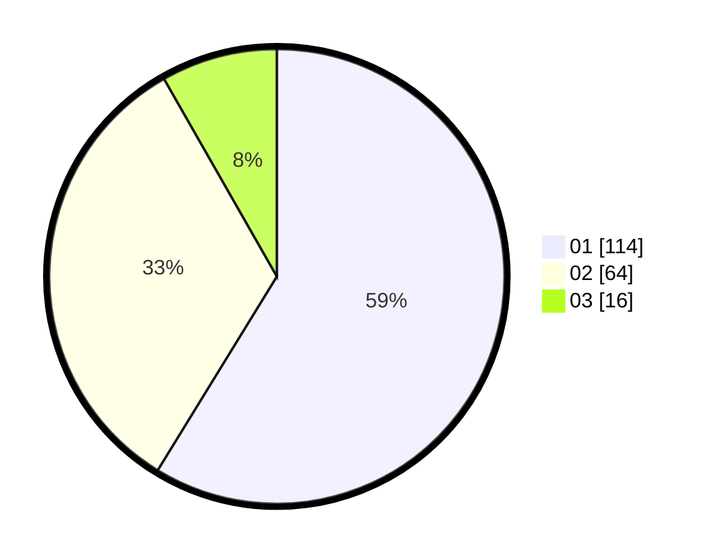

# Hasil

Hasil perolehan suara paslon dapat dilihat pada file paslon-01.txt, paslon-02.txt, dan paslon-03.txt.

Jika tidak ada, artinya data tersebut belum ada pada SIREKAP.

## Perolehan Suara

 * Paslon 01: **114**.
 * Paslon 02: **64**.
 * Paslon 03: **16**.

## Foto C Plano

https://sirekap-obj-formc.kpu.go.id/9ec5/pemilu/ppwp/31/75/03/10/05/3175031005043-20240214-175318--1b9aae4e-bcda-43df-bf8b-3733b08c0e0f.jpg

https://sirekap-obj-formc.kpu.go.id/9ec5/pemilu/ppwp/31/75/03/10/05/3175031005043-20240214-175324--bb30420c-bdb4-4737-bc8b-d9fc27ab6951.jpg

https://sirekap-obj-formc.kpu.go.id/9ec5/pemilu/ppwp/31/75/03/10/05/3175031005043-20240214-175329--4cf34582-1f7a-466c-8b3e-58413ea06874.jpg

## DATA PEMILIH TETAP

Jumlah pemilih dalam DPT: **274**.
 * L: **122**.
 * P: **152**.

## DATA PENGGUNA HAK PILIH

Jumlah pengguna hak pilih dalam DPT: **195**.
 * L: **87**.
 * P: **108**.

Jumlah pengguna hak pilih dalam DPTb: **2**.
 * L: **2**.
 * P: **0**.

Jumlah pengguna hak pilih dalam DPK: **0**.
 * L: **0**.
 * P: **0**.

Jumlah pengguna hak pilih: **197**.
 * L: **89**.
 * P: **108**.

## JUMLAH SUARA SAH DAN TIDAK SAH

JUMLAH SELURUH SUARA SAH: **194**.

JUMLAH SUARA TIDAK SAH: **3**.

JUMLAH SELURUH SUARA SAH DAN SUARA TIDAK SAH: **197**.
