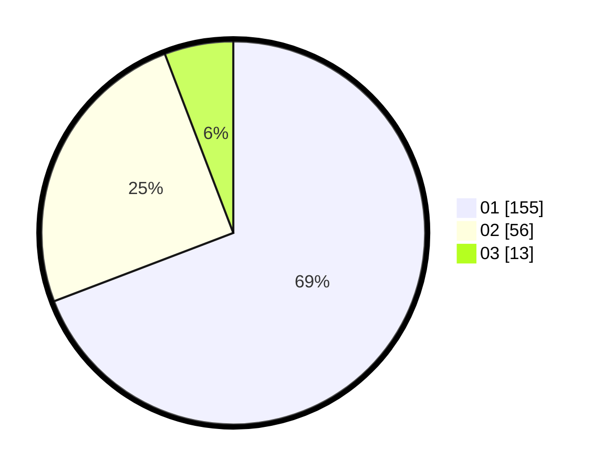

# Hasil

Hasil perolehan suara paslon dapat dilihat pada file paslon-01.txt, paslon-02.txt, dan paslon-03.txt.

Jika tidak ada, artinya data tersebut belum ada pada SIREKAP.

## Perolehan Suara

 * Paslon 01: **155**.
 * Paslon 02: **56**.
 * Paslon 03: **13**.

## Foto C Plano

https://sirekap-obj-formc.kpu.go.id/5af1/pemilu/ppwp/31/75/03/10/05/3175031005049-20240216-173631--ec698521-923f-453b-a352-2c154280d216.jpg

https://sirekap-obj-formc.kpu.go.id/5af1/pemilu/ppwp/31/75/03/10/05/3175031005049-20240216-173633--04604afa-81f1-468a-8f72-022754d0a5ca.jpg

https://sirekap-obj-formc.kpu.go.id/5af1/pemilu/ppwp/31/75/03/10/05/3175031005049-20240216-173632--8c05d0b5-41ca-49fd-bd9f-8d8680b10623.jpg

## DATA PEMILIH TETAP

Jumlah pemilih dalam DPT: **271**.
 * L: **140**.
 * P: **131**.

## DATA PENGGUNA HAK PILIH

Jumlah pengguna hak pilih dalam DPT: **221**.
 * L: **102**.
 * P: **119**.

Jumlah pengguna hak pilih dalam DPTb: **1**.
 * L: **0**.
 * P: **1**.

Jumlah pengguna hak pilih dalam DPK: **2**.
 * L: **0**.
 * P: **2**.

Jumlah pengguna hak pilih: **224**.
 * L: **102**.
 * P: **122**.

## JUMLAH SUARA SAH DAN TIDAK SAH

JUMLAH SELURUH SUARA SAH: **224**.

JUMLAH SUARA TIDAK SAH: **0**.

JUMLAH SELURUH SUARA SAH DAN SUARA TIDAK SAH: **224**.
