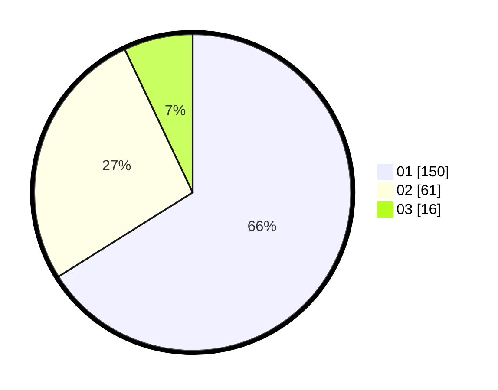

# Hasil

Hasil perolehan suara paslon dapat dilihat pada file paslon-01.txt, paslon-02.txt, dan paslon-03.txt.

Jika tidak ada, artinya data tersebut belum ada pada SIREKAP.

## Perolehan Suara

 * Paslon 01: **150**.
 * Paslon 02: **61**.
 * Paslon 03: **16**.

## Foto C Plano

https://sirekap-obj-formc.kpu.go.id/892f/pemilu/ppwp/31/75/03/10/05/3175031005050-20240216-145557--740bfc91-f4a0-4c65-950c-c949022ef535.jpg

https://sirekap-obj-formc.kpu.go.id/892f/pemilu/ppwp/31/75/03/10/05/3175031005050-20240216-145559--618e38ba-a1ef-4930-9a41-6a5745ca2195.jpg

https://sirekap-obj-formc.kpu.go.id/892f/pemilu/ppwp/31/75/03/10/05/3175031005050-20240216-145558--b1804574-50e2-4655-b204-840f65f59250.jpg

## DATA PEMILIH TETAP

Jumlah pemilih dalam DPT: **270**.
 * L: **136**.
 * P: **134**.

## DATA PENGGUNA HAK PILIH

Jumlah pengguna hak pilih dalam DPT: **216**.
 * L: **103**.
 * P: **113**.

Jumlah pengguna hak pilih dalam DPTb: **5**.
 * L: **2**.
 * P: **3**.

Jumlah pengguna hak pilih dalam DPK: **6**.
 * L: **3**.
 * P: **3**.

Jumlah pengguna hak pilih: **227**.
 * L: **108**.
 * P: **119**.

## JUMLAH SUARA SAH DAN TIDAK SAH

JUMLAH SELURUH SUARA SAH: **227**.

JUMLAH SUARA TIDAK SAH: **0**.

JUMLAH SELURUH SUARA SAH DAN SUARA TIDAK SAH: **227**.
