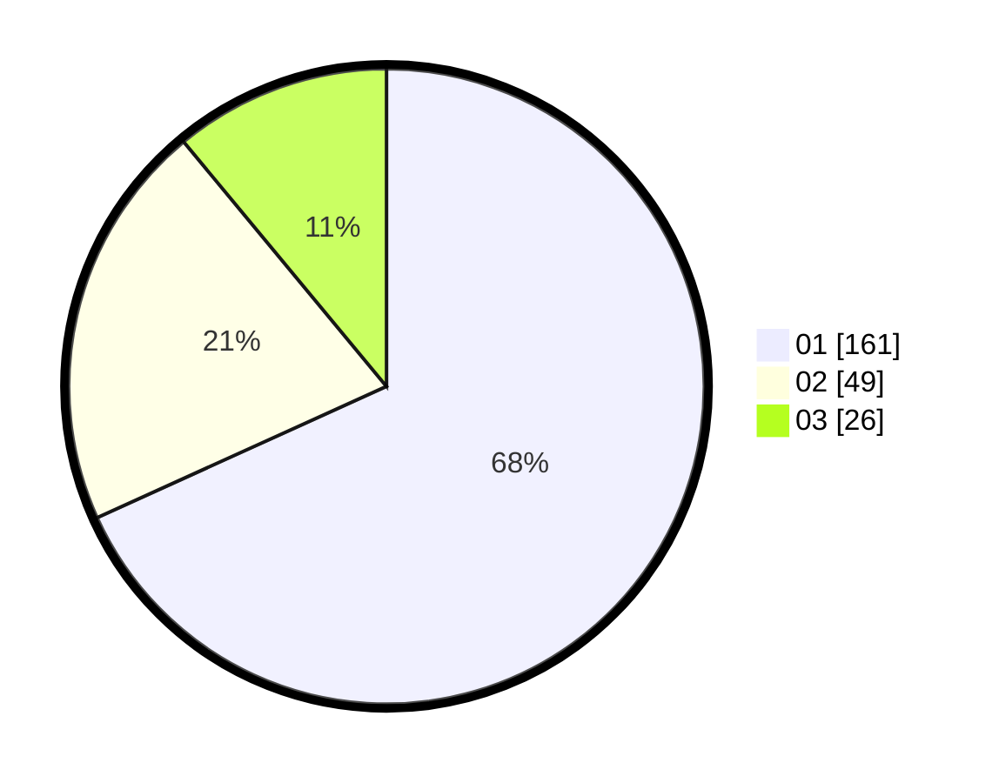

# Hasil

Hasil perolehan suara paslon dapat dilihat pada file paslon-01.txt, paslon-02.txt, dan paslon-03.txt.

Jika tidak ada, artinya data tersebut belum ada pada SIREKAP.

## Perolehan Suara

 * Paslon 01: **161**.
 * Paslon 02: **49**.
 * Paslon 03: **26**.

## Foto C Plano

https://sirekap-obj-formc.kpu.go.id/c5bc/pemilu/ppwp/31/75/03/10/05/3175031005051-20240216-152708--be4da0c4-0ab5-4085-a99b-832f51de00bf.jpg

https://sirekap-obj-formc.kpu.go.id/c5bc/pemilu/ppwp/31/75/03/10/05/3175031005051-20240216-152709--839f64b9-f3f4-4367-af4c-7e6cec810482.jpg

https://sirekap-obj-formc.kpu.go.id/c5bc/pemilu/ppwp/31/75/03/10/05/3175031005051-20240216-152708--3496551b-396f-4a68-9c48-c4e2f0553f9e.jpg

## DATA PEMILIH TETAP

Jumlah pemilih dalam DPT: **272**.
 * L: **133**.
 * P: **139**.

## DATA PENGGUNA HAK PILIH

Jumlah pengguna hak pilih dalam DPT: **230**.
 * L: **107**.
 * P: **123**.

Jumlah pengguna hak pilih dalam DPTb: **5**.
 * L: **2**.
 * P: **3**.

Jumlah pengguna hak pilih dalam DPK: **2**.
 * L: **0**.
 * P: **2**.

Jumlah pengguna hak pilih: **237**.
 * L: **109**.
 * P: **128**.

## JUMLAH SUARA SAH DAN TIDAK SAH

JUMLAH SELURUH SUARA SAH: **236**.

JUMLAH SUARA TIDAK SAH: **1**.

JUMLAH SELURUH SUARA SAH DAN SUARA TIDAK SAH: **237**.
