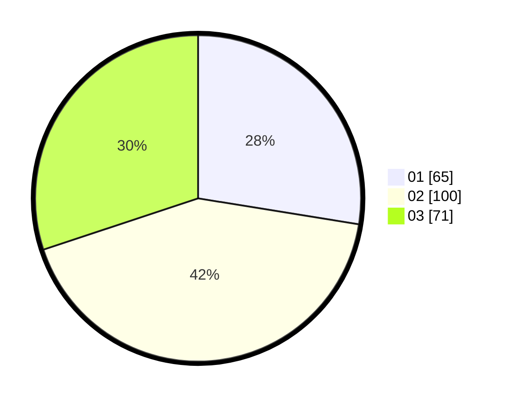

# Hasil

Hasil perolehan suara paslon dapat dilihat pada file paslon-01.txt, paslon-02.txt, dan paslon-03.txt.

Jika tidak ada, artinya data tersebut belum ada pada SIREKAP.

## Perolehan Suara

 * Paslon 01: **65**.
 * Paslon 02: **100**.
 * Paslon 03: **71**.

## Foto C Plano

https://sirekap-obj-formc.kpu.go.id/c594/pemilu/ppwp/31/75/03/10/05/3175031005060-20240216-132539--3666a0fa-4d94-4c57-b984-19a11e02c2da.jpg

https://sirekap-obj-formc.kpu.go.id/c594/pemilu/ppwp/31/75/03/10/05/3175031005060-20240216-132540--668a3250-1a0e-4910-a02a-2749d3151030.jpg

https://sirekap-obj-formc.kpu.go.id/c594/pemilu/ppwp/31/75/03/10/05/3175031005060-20240216-132540--1692c47c-14a1-4fc3-977b-a21f6cd4dc0c.jpg

## DATA PEMILIH TETAP

Jumlah pemilih dalam DPT: **294**.
 * L: **142**.
 * P: **152**.

## DATA PENGGUNA HAK PILIH

Jumlah pengguna hak pilih dalam DPT: **222**.
 * L: **103**.
 * P: **119**.

Jumlah pengguna hak pilih dalam DPTb: **18**.
 * L: **7**.
 * P: **11**.

Jumlah pengguna hak pilih dalam DPK: **1**.
 * L: **1**.
 * P: **0**.

Jumlah pengguna hak pilih: **241**.
 * L: **111**.
 * P: **130**.

## JUMLAH SUARA SAH DAN TIDAK SAH

JUMLAH SELURUH SUARA SAH: **236**.

JUMLAH SUARA TIDAK SAH: **6**.

JUMLAH SELURUH SUARA SAH DAN SUARA TIDAK SAH: **242**.
