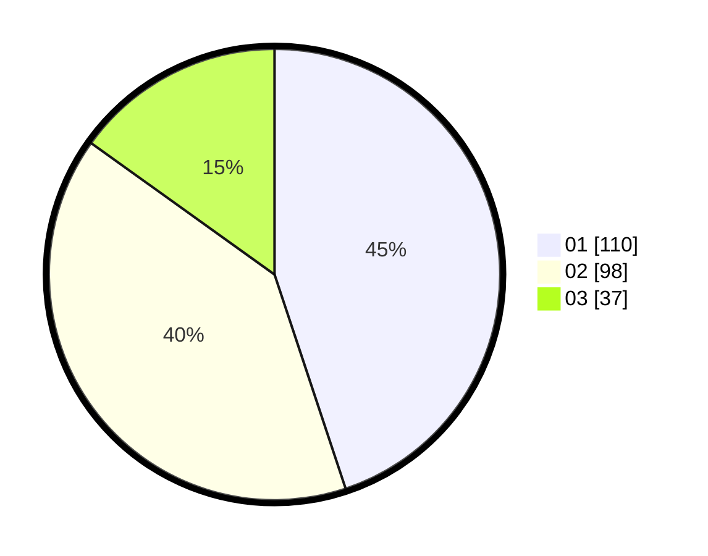

# Hasil

Hasil perolehan suara paslon dapat dilihat pada file paslon-01.txt, paslon-02.txt, dan paslon-03.txt.

Jika tidak ada, artinya data tersebut belum ada pada SIREKAP.

## Perolehan Suara

 * Paslon 01: **110**.
 * Paslon 02: **98**.
 * Paslon 03: **37**.

## Foto C Plano

https://sirekap-obj-formc.kpu.go.id/b1fe/pemilu/ppwp/31/75/03/10/05/3175031005062-20240214-235425--63369537-5ed0-4bc3-a94b-14d5280a9d4b.jpg

https://sirekap-obj-formc.kpu.go.id/b1fe/pemilu/ppwp/31/75/03/10/05/3175031005062-20240214-235740--27e24abb-87f9-464c-be8d-320c444d469c.jpg

https://sirekap-obj-formc.kpu.go.id/b1fe/pemilu/ppwp/31/75/03/10/05/3175031005062-20240214-235757--f2d3fa07-d6a5-40c8-bb42-11acad8535b9.jpg
