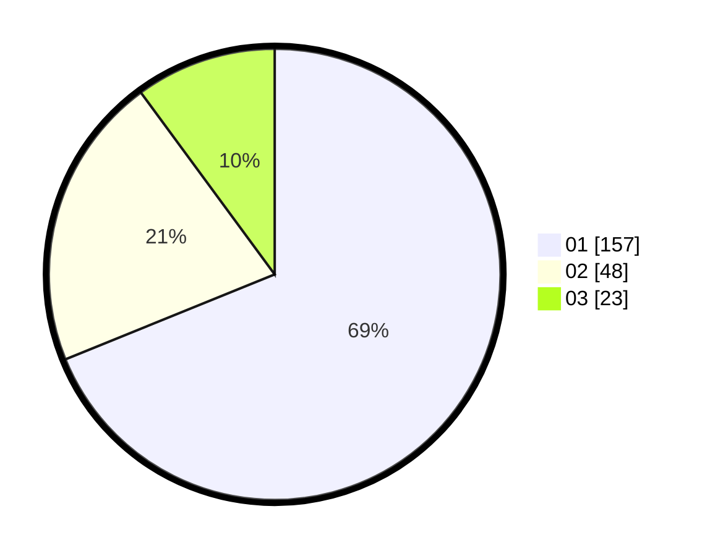

# Hasil

Hasil perolehan suara paslon dapat dilihat pada file paslon-01.txt, paslon-02.txt, dan paslon-03.txt.

Jika tidak ada, artinya data tersebut belum ada pada SIREKAP.

## Perolehan Suara

 * Paslon 01: **157**.
 * Paslon 02: **48**.
 * Paslon 03: **23**.

## Foto C Plano

https://sirekap-obj-formc.kpu.go.id/5930/pemilu/ppwp/31/75/03/10/05/3175031005063-20240215-170246--80945980-0d72-462f-b7b6-5dae4fa3df0d.jpg

https://sirekap-obj-formc.kpu.go.id/5930/pemilu/ppwp/31/75/03/10/05/3175031005063-20240215-170315--99c87c5e-f0be-4f50-a03c-c125c5647e75.jpg

https://sirekap-obj-formc.kpu.go.id/5930/pemilu/ppwp/31/75/03/10/05/3175031005063-20240215-170303--ff4a198b-0787-4925-a213-ab38db1b368a.jpg

## DATA PEMILIH TETAP

Jumlah pemilih dalam DPT: **262**.
 * L: **129**.
 * P: **133**.

## DATA PENGGUNA HAK PILIH

Jumlah pengguna hak pilih dalam DPT: **207**.
 * L: **99**.
 * P: **108**.

Jumlah pengguna hak pilih dalam DPTb: **19**.
 * L: **10**.
 * P: **9**.

Jumlah pengguna hak pilih dalam DPK: **3**.
 * L: **3**.
 * P: **0**.

Jumlah pengguna hak pilih: **229**.
 * L: **112**.
 * P: **117**.

## JUMLAH SUARA SAH DAN TIDAK SAH

JUMLAH SELURUH SUARA SAH: **228**.

JUMLAH SUARA TIDAK SAH: **1**.

JUMLAH SELURUH SUARA SAH DAN SUARA TIDAK SAH: **229**.
