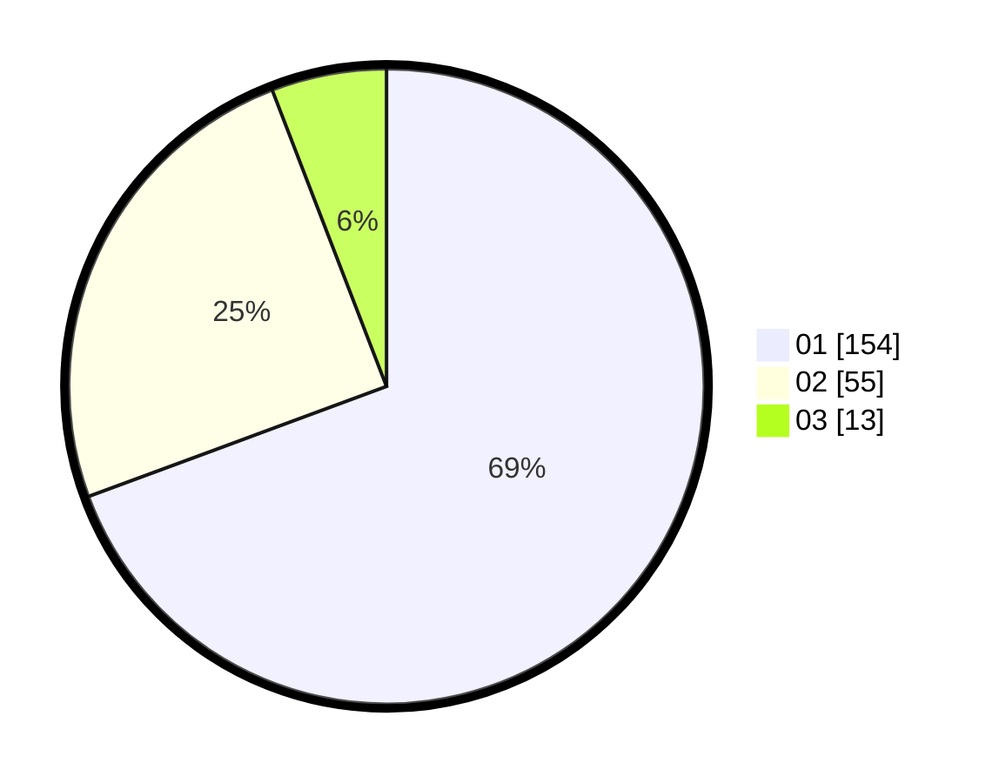

# Hasil

Hasil perolehan suara paslon dapat dilihat pada file paslon-01.txt, paslon-02.txt, dan paslon-03.txt.

Jika tidak ada, artinya data tersebut belum ada pada SIREKAP.

## Perolehan Suara

 * Paslon 01: **154**.
 * Paslon 02: **55**.
 * Paslon 03: **13**.

## Foto C Plano

https://sirekap-obj-formc.kpu.go.id/7645/pemilu/ppwp/31/75/03/10/05/3175031005064-20240215-205056--662da2dc-f577-4420-8537-e5dd2756023d.jpg

https://sirekap-obj-formc.kpu.go.id/7645/pemilu/ppwp/31/75/03/10/05/3175031005064-20240215-180144--7d6e8c61-c148-4c02-b695-8b6578fbc4f5.jpg

https://sirekap-obj-formc.kpu.go.id/7645/pemilu/ppwp/31/75/03/10/05/3175031005064-20240215-001754--3d9b7994-fa53-4ac1-bd39-6d0c3a0bffad.jpg
