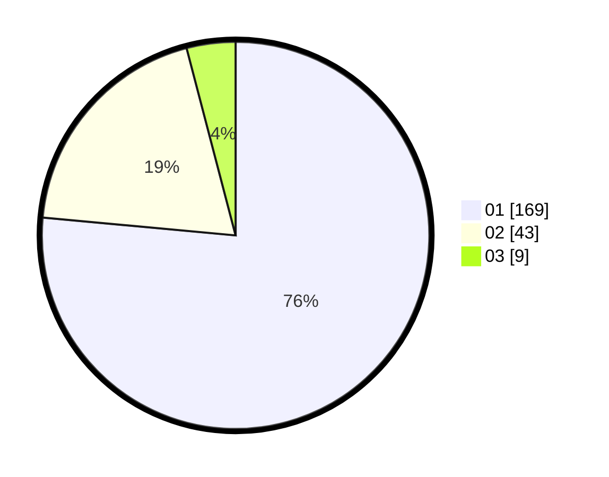

# Hasil

Hasil perolehan suara paslon dapat dilihat pada file paslon-01.txt, paslon-02.txt, dan paslon-03.txt.

Jika tidak ada, artinya data tersebut belum ada pada SIREKAP.

## Perolehan Suara

 * Paslon 01: **169**.
 * Paslon 02: **43**.
 * Paslon 03: **9**.

## Foto C Plano

https://sirekap-obj-formc.kpu.go.id/30a9/pemilu/ppwp/31/75/03/10/05/3175031005066-20240215-000447--cbdd7ae8-fe7d-45d4-aff0-0a4128d7f17d.jpg

https://sirekap-obj-formc.kpu.go.id/30a9/pemilu/ppwp/31/75/03/10/05/3175031005066-20240215-000629--c6481b7c-394f-4809-a453-067bb838e523.jpg

https://sirekap-obj-formc.kpu.go.id/30a9/pemilu/ppwp/31/75/03/10/05/3175031005066-20240215-000743--9dde41ca-75be-41cc-9ac9-2b2d72843dab.jpg
