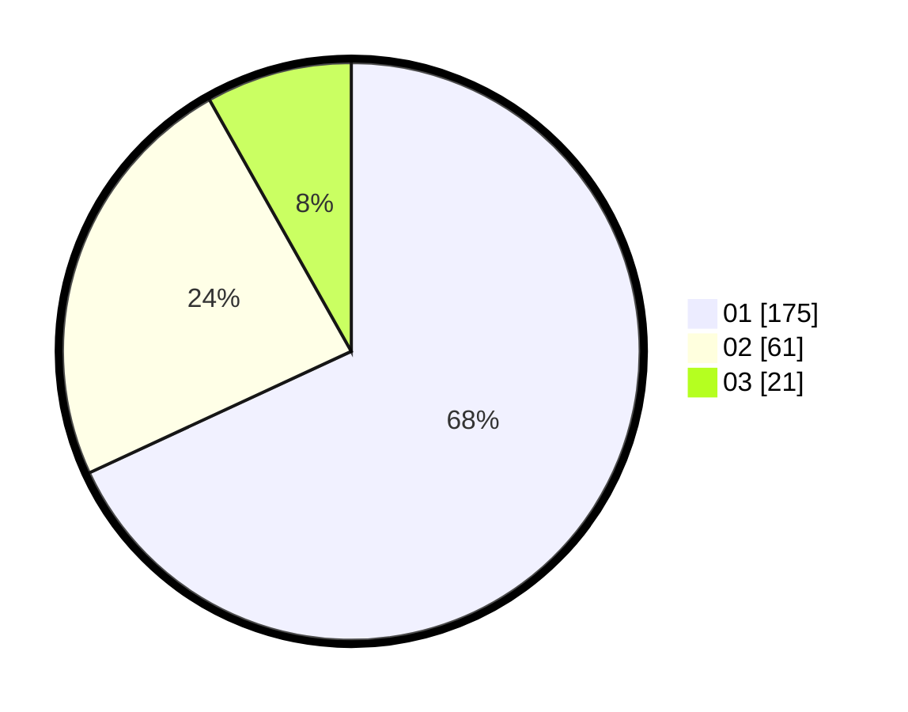

# Hasil

Hasil perolehan suara paslon dapat dilihat pada file paslon-01.txt, paslon-02.txt, dan paslon-03.txt.

Jika tidak ada, artinya data tersebut belum ada pada SIREKAP.

## Perolehan Suara

 * Paslon 01: **175**.
 * Paslon 02: **61**.
 * Paslon 03: **21**.

## Foto C Plano

https://sirekap-obj-formc.kpu.go.id/4426/pemilu/ppwp/31/75/03/10/05/3175031005079-20240216-042916--aeb04d3b-bbea-4a07-a6b1-a87d8a94e1ad.jpg

https://sirekap-obj-formc.kpu.go.id/4426/pemilu/ppwp/31/75/03/10/05/3175031005079-20240216-042739--2f9b6ff6-ee26-444b-97d6-1c9eca5b7966.jpg

https://sirekap-obj-formc.kpu.go.id/4426/pemilu/ppwp/31/75/03/10/05/3175031005079-20240216-042736--e4ff35d3-c454-4540-8b02-151911f9b334.jpg

## DATA PEMILIH TETAP

Jumlah pemilih dalam DPT: **296**.
 * L: **149**.
 * P: **147**.

## DATA PENGGUNA HAK PILIH

Jumlah pengguna hak pilih dalam DPT: **247**.
 * L: **124**.
 * P: **123**.

Jumlah pengguna hak pilih dalam DPTb: **10**.
 * L: **4**.
 * P: **6**.

Jumlah pengguna hak pilih dalam DPK: **2**.
 * L: **1**.
 * P: **1**.

Jumlah pengguna hak pilih: **259**.
 * L: **129**.
 * P: **130**.

## JUMLAH SUARA SAH DAN TIDAK SAH

JUMLAH SELURUH SUARA SAH: **257**.

JUMLAH SUARA TIDAK SAH: **2**.

JUMLAH SELURUH SUARA SAH DAN SUARA TIDAK SAH: **259**.
