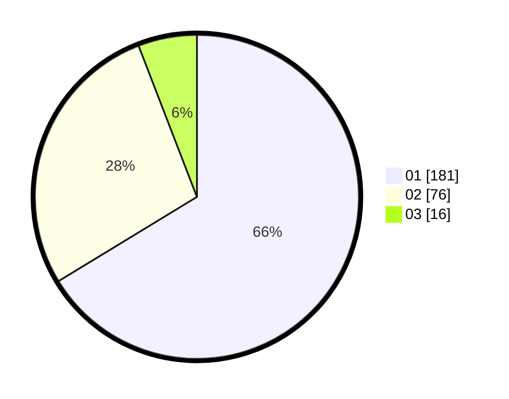

# Hasil

Hasil perolehan suara paslon dapat dilihat pada file paslon-01.txt, paslon-02.txt, dan paslon-03.txt.

Jika tidak ada, artinya data tersebut belum ada pada SIREKAP.

## Perolehan Suara

 * Paslon 01: **181**.
 * Paslon 02: **76**.
 * Paslon 03: **16**.

## Foto C Plano

https://sirekap-obj-formc.kpu.go.id/9840/pemilu/ppwp/31/75/03/10/05/3175031005080-20240215-225515--ffaf4001-1427-4490-afde-b79c393095ce.jpg

https://sirekap-obj-formc.kpu.go.id/9840/pemilu/ppwp/31/75/03/10/05/3175031005080-20240215-225518--066526be-4c81-4ff8-908a-0dd99e6f8b2d.jpg

https://sirekap-obj-formc.kpu.go.id/9840/pemilu/ppwp/31/75/03/10/05/3175031005080-20240215-225516--2edcd82d-b182-4e3f-886d-2ea17f849730.jpg

## DATA PEMILIH TETAP

Jumlah pemilih dalam DPT: **292**.
 * L: **142**.
 * P: **150**.

## DATA PENGGUNA HAK PILIH

Jumlah pengguna hak pilih dalam DPT: **259**.
 * L: **124**.
 * P: **135**.

Jumlah pengguna hak pilih dalam DPTb: **12**.
 * L: **3**.
 * P: **9**.

Jumlah pengguna hak pilih dalam DPK: **3**.
 * L: **1**.
 * P: **2**.

Jumlah pengguna hak pilih: **274**.
 * L: **128**.
 * P: **146**.

## JUMLAH SUARA SAH DAN TIDAK SAH

JUMLAH SELURUH SUARA SAH: **273**.

JUMLAH SUARA TIDAK SAH: **1**.

JUMLAH SELURUH SUARA SAH DAN SUARA TIDAK SAH: **274**.
