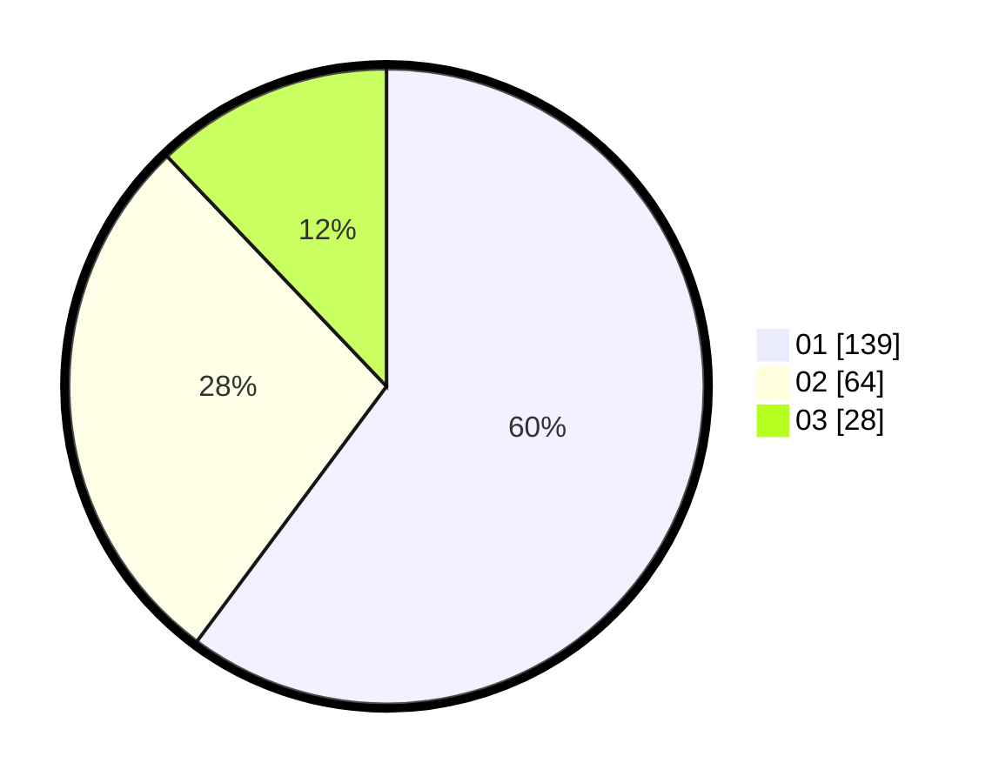

# Hasil

Hasil perolehan suara paslon dapat dilihat pada file paslon-01.txt, paslon-02.txt, dan paslon-03.txt.

Jika tidak ada, artinya data tersebut belum ada pada SIREKAP.

## Perolehan Suara

 * Paslon 01: **139**.
 * Paslon 02: **64**.
 * Paslon 03: **28**.

## Foto C Plano

https://sirekap-obj-formc.kpu.go.id/9f44/pemilu/ppwp/31/75/03/10/05/3175031005085-20240214-221932--dc6bfb08-48a5-4830-a175-455ba06edf9c.jpg

https://sirekap-obj-formc.kpu.go.id/9f44/pemilu/ppwp/31/75/03/10/05/3175031005085-20240214-222035--e82ed1b2-e6b7-46ff-af1a-b81bdcb561bd.jpg

https://sirekap-obj-formc.kpu.go.id/9f44/pemilu/ppwp/31/75/03/10/05/3175031005085-20240214-222207--1cc59c19-5da1-484c-94bc-25c0077c35a5.jpg
