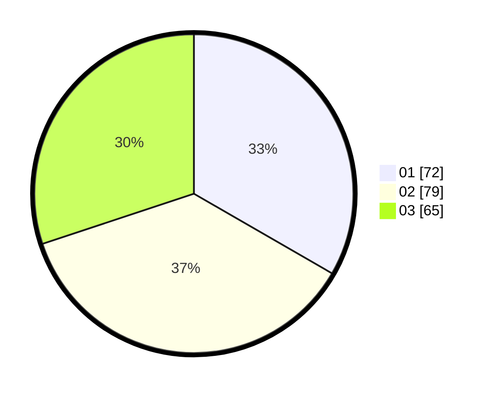

# Hasil

Hasil perolehan suara paslon dapat dilihat pada file paslon-01.txt, paslon-02.txt, dan paslon-03.txt.

Jika tidak ada, artinya data tersebut belum ada pada SIREKAP.

## Perolehan Suara

 * Paslon 01: **72**.
 * Paslon 02: **79**.
 * Paslon 03: **65**.

## Foto C Plano

https://sirekap-obj-formc.kpu.go.id/db43/pemilu/ppwp/31/75/03/10/05/3175031005089-20240214-193158--c79e4c52-9cd9-4733-bf3d-4eb867f0596f.jpg

https://sirekap-obj-formc.kpu.go.id/db43/pemilu/ppwp/31/75/03/10/05/3175031005089-20240214-193646--e5dcf24c-d7cc-4b4d-bfb3-20d4fbf3ce11.jpg

https://sirekap-obj-formc.kpu.go.id/db43/pemilu/ppwp/31/75/03/10/05/3175031005089-20240214-193259--cd064577-4cfe-48fe-b527-d3b9a91f7b99.jpg

## DATA PEMILIH TETAP

Jumlah pemilih dalam DPT: **275**.
 * L: **137**.
 * P: **138**.

## DATA PENGGUNA HAK PILIH

Jumlah pengguna hak pilih dalam DPT: **204**.
 * L: **99**.
 * P: **105**.

Jumlah pengguna hak pilih dalam DPTb: **14**.
 * L: **6**.
 * P: **8**.

Jumlah pengguna hak pilih dalam DPK: **0**.
 * L: **0**.
 * P: **0**.

Jumlah pengguna hak pilih: **218**.
 * L: **105**.
 * P: **113**.

## JUMLAH SUARA SAH DAN TIDAK SAH

JUMLAH SELURUH SUARA SAH: **216**.

JUMLAH SUARA TIDAK SAH: **2**.

JUMLAH SELURUH SUARA SAH DAN SUARA TIDAK SAH: **218**.
