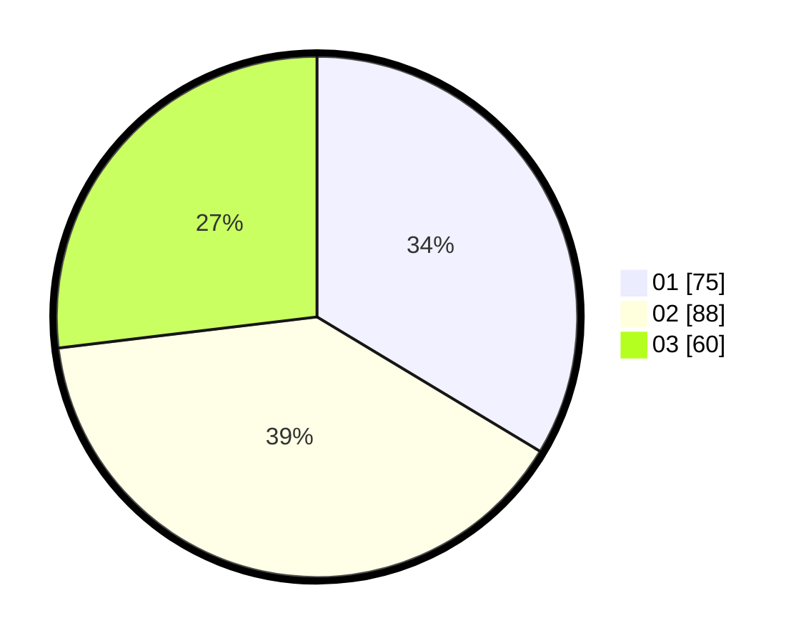

# Hasil

Hasil perolehan suara paslon dapat dilihat pada file paslon-01.txt, paslon-02.txt, dan paslon-03.txt.

Jika tidak ada, artinya data tersebut belum ada pada SIREKAP.

## Perolehan Suara

 * Paslon 01: **75**.
 * Paslon 02: **88**.
 * Paslon 03: **60**.

## Foto C Plano

https://sirekap-obj-formc.kpu.go.id/d4d6/pemilu/ppwp/31/75/03/10/05/3175031005090-20240214-155634--0654a1e6-c28a-491e-8a06-b3bd344cc50e.jpg

https://sirekap-obj-formc.kpu.go.id/d4d6/pemilu/ppwp/31/75/03/10/05/3175031005090-20240214-155846--d8aa1063-b6a8-42a9-8d8c-03a640430a78.jpg

https://sirekap-obj-formc.kpu.go.id/d4d6/pemilu/ppwp/31/75/03/10/05/3175031005090-20240214-185849--40195822-130a-4651-81dc-1e906874712f.jpg

## DATA PEMILIH TETAP

Jumlah pemilih dalam DPT: **274**.
 * L: **133**.
 * P: **141**.

## DATA PENGGUNA HAK PILIH

Jumlah pengguna hak pilih dalam DPT: **210**.
 * L: **97**.
 * P: **113**.

Jumlah pengguna hak pilih dalam DPTb: **10**.
 * L: **3**.
 * P: **7**.

Jumlah pengguna hak pilih dalam DPK: **3**.
 * L: **0**.
 * P: **3**.

Jumlah pengguna hak pilih: **223**.
 * L: **100**.
 * P: **123**.

## JUMLAH SUARA SAH DAN TIDAK SAH

JUMLAH SELURUH SUARA SAH: **223**.

JUMLAH SUARA TIDAK SAH: **0**.

JUMLAH SELURUH SUARA SAH DAN SUARA TIDAK SAH: **223**.
