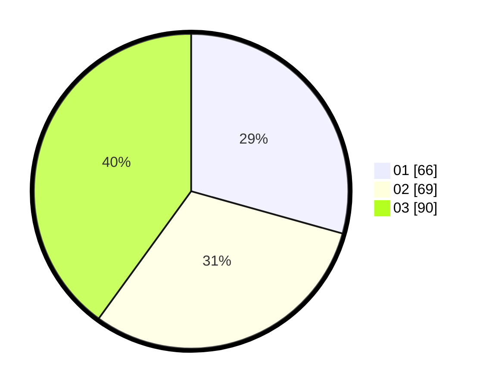

# Hasil

Hasil perolehan suara paslon dapat dilihat pada file paslon-01.txt, paslon-02.txt, dan paslon-03.txt.

Jika tidak ada, artinya data tersebut belum ada pada SIREKAP.

## Perolehan Suara

 * Paslon 01: **66**.
 * Paslon 02: **69**.
 * Paslon 03: **90**.

## Foto C Plano

https://sirekap-obj-formc.kpu.go.id/baba/pemilu/ppwp/31/75/03/10/05/3175031005092-20240216-015630--528f1d05-79c7-4ceb-ba15-153ff4a41f3f.jpg

https://sirekap-obj-formc.kpu.go.id/baba/pemilu/ppwp/31/75/03/10/05/3175031005092-20240216-052200--0d745645-648d-4b73-8a46-7ed6aa013308.jpg

https://sirekap-obj-formc.kpu.go.id/baba/pemilu/ppwp/31/75/03/10/05/3175031005092-20240216-052200--394d4012-ba44-42e2-9437-1a5a590c5c20.jpg

## DATA PEMILIH TETAP

Jumlah pemilih dalam DPT: **275**.
 * L: **132**.
 * P: **143**.

## DATA PENGGUNA HAK PILIH

Jumlah pengguna hak pilih dalam DPT: **210**.
 * L: **105**.
 * P: **105**.

Jumlah pengguna hak pilih dalam DPTb: **15**.
 * L: **6**.
 * P: **9**.

Jumlah pengguna hak pilih dalam DPK: **4**.
 * L: **1**.
 * P: **3**.

Jumlah pengguna hak pilih: **229**.
 * L: **112**.
 * P: **117**.

## JUMLAH SUARA SAH DAN TIDAK SAH

JUMLAH SELURUH SUARA SAH: **225**.

JUMLAH SUARA TIDAK SAH: **4**.

JUMLAH SELURUH SUARA SAH DAN SUARA TIDAK SAH: **229**.
