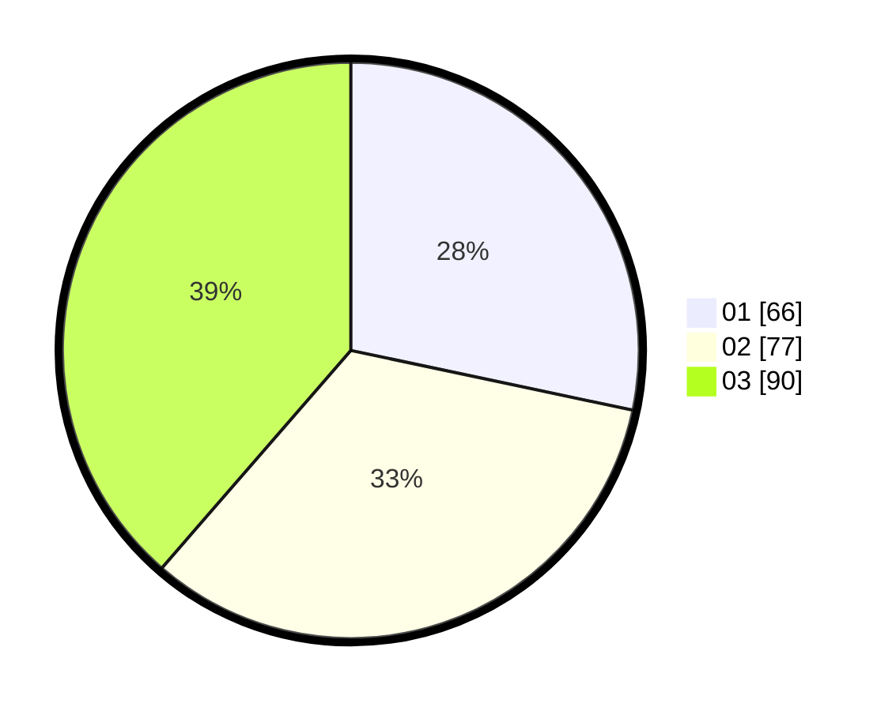

# Hasil

Hasil perolehan suara paslon dapat dilihat pada file paslon-01.txt, paslon-02.txt, dan paslon-03.txt.

Jika tidak ada, artinya data tersebut belum ada pada SIREKAP.

## Perolehan Suara

 * Paslon 01: **66**.
 * Paslon 02: **77**.
 * Paslon 03: **90**.

## Foto C Plano

https://sirekap-obj-formc.kpu.go.id/b6b6/pemilu/ppwp/31/75/03/10/05/3175031005093-20240216-132550--56dcd852-d36d-4710-b153-b48a92744bb9.jpg

https://sirekap-obj-formc.kpu.go.id/b6b6/pemilu/ppwp/31/75/03/10/05/3175031005093-20240216-132552--074402b2-7659-4b30-98d1-efc016ef6e6e.jpg

https://sirekap-obj-formc.kpu.go.id/b6b6/pemilu/ppwp/31/75/03/10/05/3175031005093-20240216-132551--611983a2-a5b7-426e-acde-84e80cfceebb.jpg

## DATA PEMILIH TETAP

Jumlah pemilih dalam DPT: **273**.
 * L: **131**.
 * P: **142**.

## DATA PENGGUNA HAK PILIH

Jumlah pengguna hak pilih dalam DPT: **215**.
 * L: **99**.
 * P: **116**.

Jumlah pengguna hak pilih dalam DPTb: **20**.
 * L: **9**.
 * P: **11**.

Jumlah pengguna hak pilih dalam DPK: **0**.
 * L: **0**.
 * P: **0**.

Jumlah pengguna hak pilih: **235**.
 * L: **108**.
 * P: **127**.

## JUMLAH SUARA SAH DAN TIDAK SAH

JUMLAH SELURUH SUARA SAH: **233**.

JUMLAH SUARA TIDAK SAH: **2**.

JUMLAH SELURUH SUARA SAH DAN SUARA TIDAK SAH: **235**.
