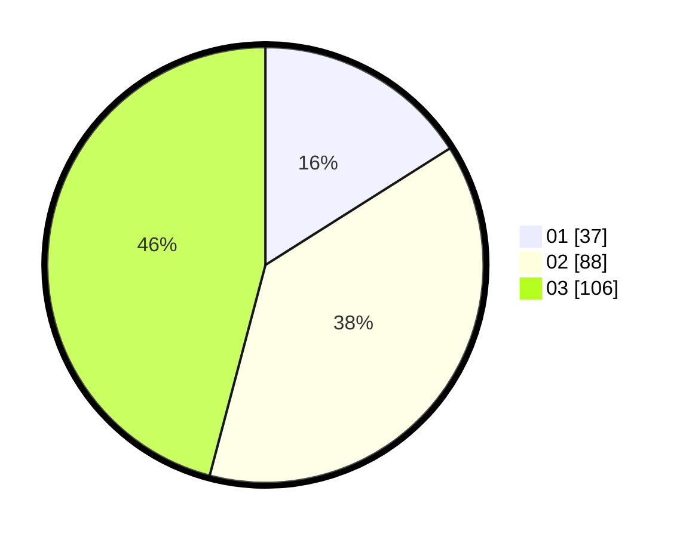

# Hasil

Hasil perolehan suara paslon dapat dilihat pada file paslon-01.txt, paslon-02.txt, dan paslon-03.txt.

Jika tidak ada, artinya data tersebut belum ada pada SIREKAP.

## Perolehan Suara

 * Paslon 01: **37**.
 * Paslon 02: **88**.
 * Paslon 03: **106**.

## Foto C Plano

https://sirekap-obj-formc.kpu.go.id/4a35/pemilu/ppwp/31/75/03/10/05/3175031005094-20240215-225909--c08866ce-51dd-42a5-abf1-148d086e5094.jpg

https://sirekap-obj-formc.kpu.go.id/4a35/pemilu/ppwp/31/75/03/10/05/3175031005094-20240215-225911--85fae090-cc95-4f02-ab67-09c86454460e.jpg

https://sirekap-obj-formc.kpu.go.id/4a35/pemilu/ppwp/31/75/03/10/05/3175031005094-20240215-225910--099f3e41-277c-451a-af36-6e0e0961db30.jpg

## DATA PEMILIH TETAP

Jumlah pemilih dalam DPT: **281**.
 * L: **140**.
 * P: **141**.

## DATA PENGGUNA HAK PILIH

Jumlah pengguna hak pilih dalam DPT: **209**.
 * L: **100**.
 * P: **109**.

Jumlah pengguna hak pilih dalam DPTb: **19**.
 * L: **10**.
 * P: **9**.

Jumlah pengguna hak pilih dalam DPK: **5**.
 * L: **1**.
 * P: **4**.

Jumlah pengguna hak pilih: **233**.
 * L: **111**.
 * P: **122**.

## JUMLAH SUARA SAH DAN TIDAK SAH

JUMLAH SELURUH SUARA SAH: **231**.

JUMLAH SUARA TIDAK SAH: **2**.

JUMLAH SELURUH SUARA SAH DAN SUARA TIDAK SAH: **233**.
