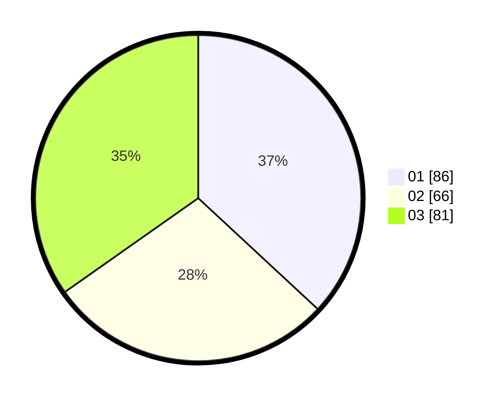

# Hasil

Hasil perolehan suara paslon dapat dilihat pada file paslon-01.txt, paslon-02.txt, dan paslon-03.txt.

Jika tidak ada, artinya data tersebut belum ada pada SIREKAP.

## Perolehan Suara

 * Paslon 01: **86**.
 * Paslon 02: **66**.
 * Paslon 03: **81**.

## Foto C Plano

https://sirekap-obj-formc.kpu.go.id/9f3e/pemilu/ppwp/31/75/03/10/05/3175031005100-20240216-001336--5edb265a-3fab-4bf5-a171-c1f927c34438.jpg

https://sirekap-obj-formc.kpu.go.id/9f3e/pemilu/ppwp/31/75/03/10/05/3175031005100-20240216-001338--63474895-3bb7-4a04-8030-56692e37234c.jpg

https://sirekap-obj-formc.kpu.go.id/9f3e/pemilu/ppwp/31/75/03/10/05/3175031005100-20240216-001337--0efea2c3-accf-4b74-b585-b06a731f5301.jpg

## DATA PEMILIH TETAP

Jumlah pemilih dalam DPT: **285**.
 * L: **139**.
 * P: **146**.

## DATA PENGGUNA HAK PILIH

Jumlah pengguna hak pilih dalam DPT: **216**.
 * L: **99**.
 * P: **117**.

Jumlah pengguna hak pilih dalam DPTb: **19**.
 * L: **4**.
 * P: **15**.

Jumlah pengguna hak pilih dalam DPK: **4**.
 * L: **1**.
 * P: **3**.

Jumlah pengguna hak pilih: **239**.
 * L: **104**.
 * P: **135**.

## JUMLAH SUARA SAH DAN TIDAK SAH

JUMLAH SELURUH SUARA SAH: **233**.

JUMLAH SUARA TIDAK SAH: **6**.

JUMLAH SELURUH SUARA SAH DAN SUARA TIDAK SAH: **239**.
