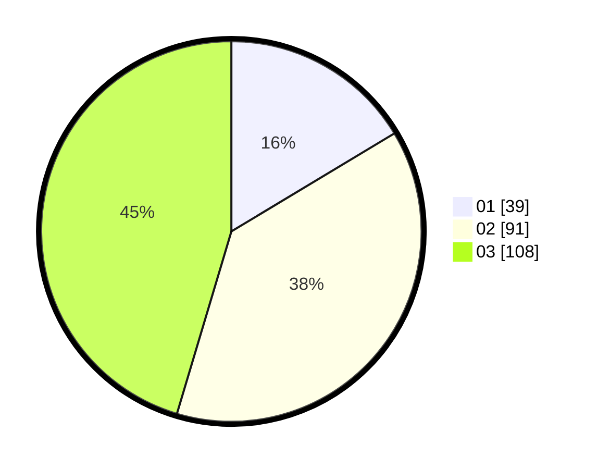

# Hasil

Hasil perolehan suara paslon dapat dilihat pada file paslon-01.txt, paslon-02.txt, dan paslon-03.txt.

Jika tidak ada, artinya data tersebut belum ada pada SIREKAP.

## Perolehan Suara

 * Paslon 01: **39**.
 * Paslon 02: **91**.
 * Paslon 03: **108**.

## Foto C Plano

https://sirekap-obj-formc.kpu.go.id/2041/pemilu/ppwp/31/75/03/10/05/3175031005101-20240216-041032--7e99f695-7052-44c9-b084-f1f292de0cbb.jpg

https://sirekap-obj-formc.kpu.go.id/2041/pemilu/ppwp/31/75/03/10/05/3175031005101-20240216-041036--e12c92ea-efd6-4914-807e-ac4cbf35ae5f.jpg

https://sirekap-obj-formc.kpu.go.id/2041/pemilu/ppwp/31/75/03/10/05/3175031005101-20240216-041033--9108c0bf-f5cc-4440-9260-7ee1c1d0d2e1.jpg

## DATA PEMILIH TETAP

Jumlah pemilih dalam DPT: **272**.
 * L: **129**.
 * P: **143**.

## DATA PENGGUNA HAK PILIH

Jumlah pengguna hak pilih dalam DPT: **221**.
 * L: **104**.
 * P: **117**.

Jumlah pengguna hak pilih dalam DPTb: **17**.
 * L: **8**.
 * P: **9**.

Jumlah pengguna hak pilih dalam DPK: **3**.
 * L: **2**.
 * P: **1**.

Jumlah pengguna hak pilih: **241**.
 * L: **114**.
 * P: **127**.

## JUMLAH SUARA SAH DAN TIDAK SAH

JUMLAH SELURUH SUARA SAH: **238**.

JUMLAH SUARA TIDAK SAH: **3**.

JUMLAH SELURUH SUARA SAH DAN SUARA TIDAK SAH: **241**.
