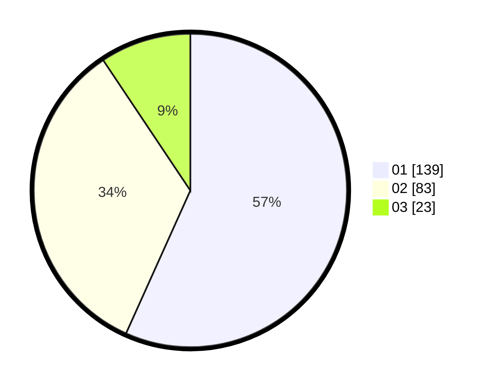

# Hasil

Hasil perolehan suara paslon dapat dilihat pada file paslon-01.txt, paslon-02.txt, dan paslon-03.txt.

Jika tidak ada, artinya data tersebut belum ada pada SIREKAP.

## Perolehan Suara

 * Paslon 01: **139**.
 * Paslon 02: **83**.
 * Paslon 03: **23**.

## Foto C Plano

https://sirekap-obj-formc.kpu.go.id/12fa/pemilu/ppwp/31/75/03/10/06/3175031006005-20240215-063021--0701bcce-2019-49f9-a757-1abcca5a280a.jpg

https://sirekap-obj-formc.kpu.go.id/12fa/pemilu/ppwp/31/75/03/10/06/3175031006005-20240215-063443--2bb5c0cb-c497-4b71-ad16-11f6340ddda0.jpg

https://sirekap-obj-formc.kpu.go.id/12fa/pemilu/ppwp/31/75/03/10/06/3175031006005-20240215-064109--d50934d7-ada4-4518-b75b-3663c8a23f14.jpg

## DATA PEMILIH TETAP

Jumlah pemilih dalam DPT: **285**.
 * L: **144**.
 * P: **141**.

## DATA PENGGUNA HAK PILIH

Jumlah pengguna hak pilih dalam DPT: **227**.
 * L: **117**.
 * P: **110**.

Jumlah pengguna hak pilih dalam DPTb: **13**.
 * L: **7**.
 * P: **6**.

Jumlah pengguna hak pilih dalam DPK: **7**.
 * L: **5**.
 * P: **2**.

Jumlah pengguna hak pilih: **247**.
 * L: **129**.
 * P: **118**.

## JUMLAH SUARA SAH DAN TIDAK SAH

JUMLAH SELURUH SUARA SAH: **245**.

JUMLAH SUARA TIDAK SAH: **2**.

JUMLAH SELURUH SUARA SAH DAN SUARA TIDAK SAH: **247**.
