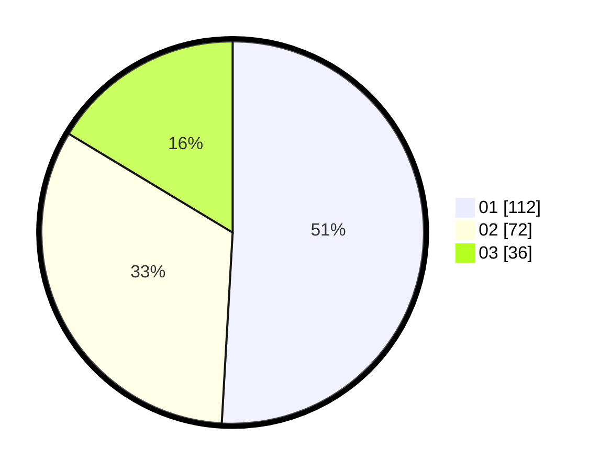

# Hasil

Hasil perolehan suara paslon dapat dilihat pada file paslon-01.txt, paslon-02.txt, dan paslon-03.txt.

Jika tidak ada, artinya data tersebut belum ada pada SIREKAP.

## Perolehan Suara

 * Paslon 01: **112**.
 * Paslon 02: **72**.
 * Paslon 03: **36**.

## Foto C Plano

https://sirekap-obj-formc.kpu.go.id/bf21/pemilu/ppwp/31/75/03/10/06/3175031006007-20240214-213848--57866328-c728-476e-9b83-c3c9d38ac1bc.jpg

https://sirekap-obj-formc.kpu.go.id/bf21/pemilu/ppwp/31/75/03/10/06/3175031006007-20240215-101204--c6bf3ea4-133c-4c00-95a4-ec04a79db7fd.jpg

https://sirekap-obj-formc.kpu.go.id/bf21/pemilu/ppwp/31/75/03/10/06/3175031006007-20240214-232044--ad47ac54-edc1-427c-bed8-dba6affce510.jpg
