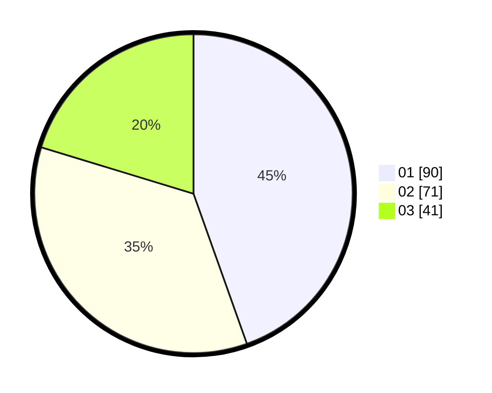

# Hasil

Hasil perolehan suara paslon dapat dilihat pada file paslon-01.txt, paslon-02.txt, dan paslon-03.txt.

Jika tidak ada, artinya data tersebut belum ada pada SIREKAP.

## Perolehan Suara

 * Paslon 01: **90**.
 * Paslon 02: **71**.
 * Paslon 03: **41**.

## Foto C Plano

https://sirekap-obj-formc.kpu.go.id/118d/pemilu/ppwp/31/75/03/10/06/3175031006008-20240216-071745--06c1e6b9-9458-4a30-9bec-3105fba1d09c.jpg

https://sirekap-obj-formc.kpu.go.id/118d/pemilu/ppwp/31/75/03/10/06/3175031006008-20240216-071747--b33eedab-dc53-4278-9049-597bde76096d.jpg

https://sirekap-obj-formc.kpu.go.id/118d/pemilu/ppwp/31/75/03/10/06/3175031006008-20240216-071746--4f70d283-4875-404c-846c-228714dc3e78.jpg

## DATA PEMILIH TETAP

Jumlah pemilih dalam DPT: **265**.
 * L: **134**.
 * P: **131**.

## DATA PENGGUNA HAK PILIH

Jumlah pengguna hak pilih dalam DPT: **197**.
 * L: **96**.
 * P: **101**.

Jumlah pengguna hak pilih dalam DPTb: **1**.
 * L: **1**.
 * P: **0**.

Jumlah pengguna hak pilih dalam DPK: **5**.
 * L: **3**.
 * P: **2**.

Jumlah pengguna hak pilih: **203**.
 * L: **100**.
 * P: **103**.

## JUMLAH SUARA SAH DAN TIDAK SAH

JUMLAH SELURUH SUARA SAH: **202**.

JUMLAH SUARA TIDAK SAH: **1**.

JUMLAH SELURUH SUARA SAH DAN SUARA TIDAK SAH: **203**.
