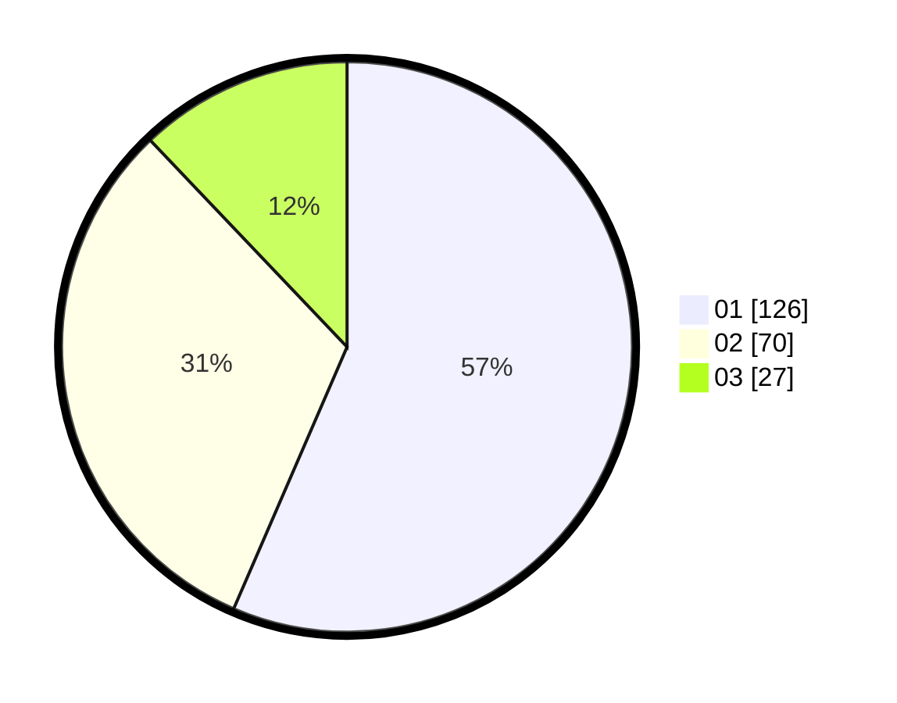

# Hasil

Hasil perolehan suara paslon dapat dilihat pada file paslon-01.txt, paslon-02.txt, dan paslon-03.txt.

Jika tidak ada, artinya data tersebut belum ada pada SIREKAP.

## Perolehan Suara

 * Paslon 01: **126**.
 * Paslon 02: **70**.
 * Paslon 03: **27**.

## Foto C Plano

https://sirekap-obj-formc.kpu.go.id/5766/pemilu/ppwp/31/75/03/10/06/3175031006011-20240215-001032--ba760d99-4a73-4d27-956b-1399074ef34d.jpg

https://sirekap-obj-formc.kpu.go.id/5766/pemilu/ppwp/31/75/03/10/06/3175031006011-20240215-001105--591aa1dc-8ffa-442a-a529-711ef268019f.jpg

https://sirekap-obj-formc.kpu.go.id/5766/pemilu/ppwp/31/75/03/10/06/3175031006011-20240215-001135--3972c780-337d-405a-b2c7-d378f31c17c2.jpg
