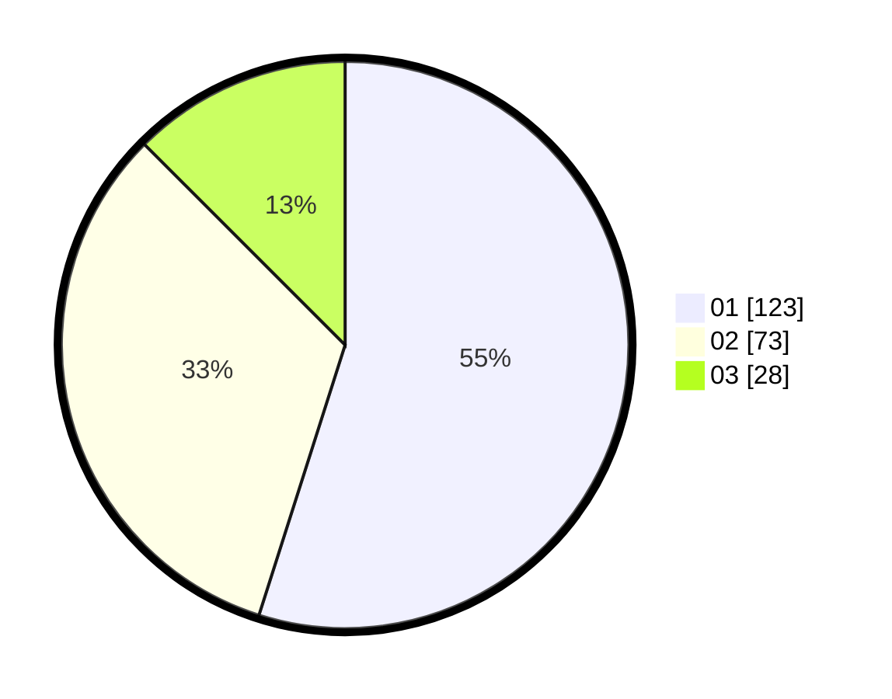

# Hasil

Hasil perolehan suara paslon dapat dilihat pada file paslon-01.txt, paslon-02.txt, dan paslon-03.txt.

Jika tidak ada, artinya data tersebut belum ada pada SIREKAP.

## Perolehan Suara

 * Paslon 01: **123**.
 * Paslon 02: **73**.
 * Paslon 03: **28**.

## Foto C Plano

https://sirekap-obj-formc.kpu.go.id/5092/pemilu/ppwp/31/75/03/10/06/3175031006014-20240215-000356--54c87ca3-5572-4799-826a-401c6087e08b.jpg

https://sirekap-obj-formc.kpu.go.id/5092/pemilu/ppwp/31/75/03/10/06/3175031006014-20240215-000431--a96fa011-487b-4306-a4dd-4244976a10ec.jpg

https://sirekap-obj-formc.kpu.go.id/5092/pemilu/ppwp/31/75/03/10/06/3175031006014-20240215-000454--79ff9d83-e9cc-43eb-8c84-66b9d65706e6.jpg
