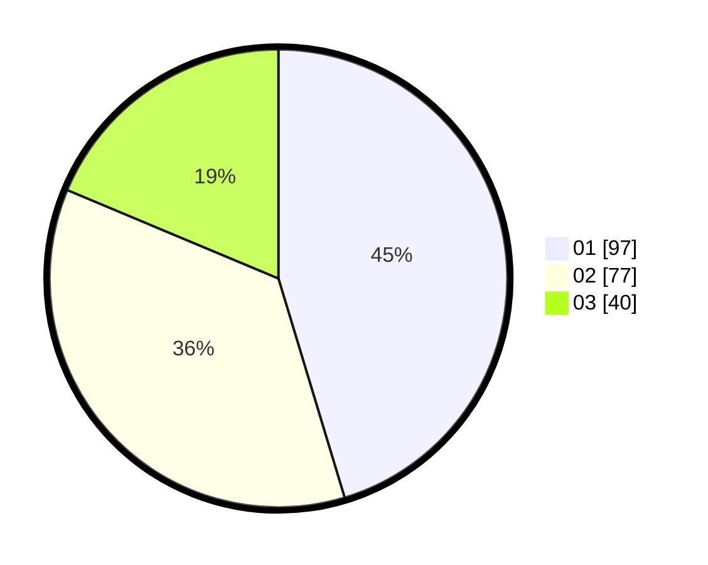

# Hasil

Hasil perolehan suara paslon dapat dilihat pada file paslon-01.txt, paslon-02.txt, dan paslon-03.txt.

Jika tidak ada, artinya data tersebut belum ada pada SIREKAP.

## Perolehan Suara

 * Paslon 01: **97**.
 * Paslon 02: **77**.
 * Paslon 03: **40**.

## Foto C Plano

https://sirekap-obj-formc.kpu.go.id/6e61/pemilu/ppwp/31/75/03/10/06/3175031006020-20240214-215335--b292e49d-03e4-4cd5-ac0e-cd5559861016.jpg

https://sirekap-obj-formc.kpu.go.id/6e61/pemilu/ppwp/31/75/03/10/06/3175031006020-20240214-155736--eb6377a1-bd93-45dc-8f8f-6391c129d8ac.jpg

https://sirekap-obj-formc.kpu.go.id/6e61/pemilu/ppwp/31/75/03/10/06/3175031006020-20240214-184454--71508864-e681-45e1-b2e4-e2da3f22fbb0.jpg
