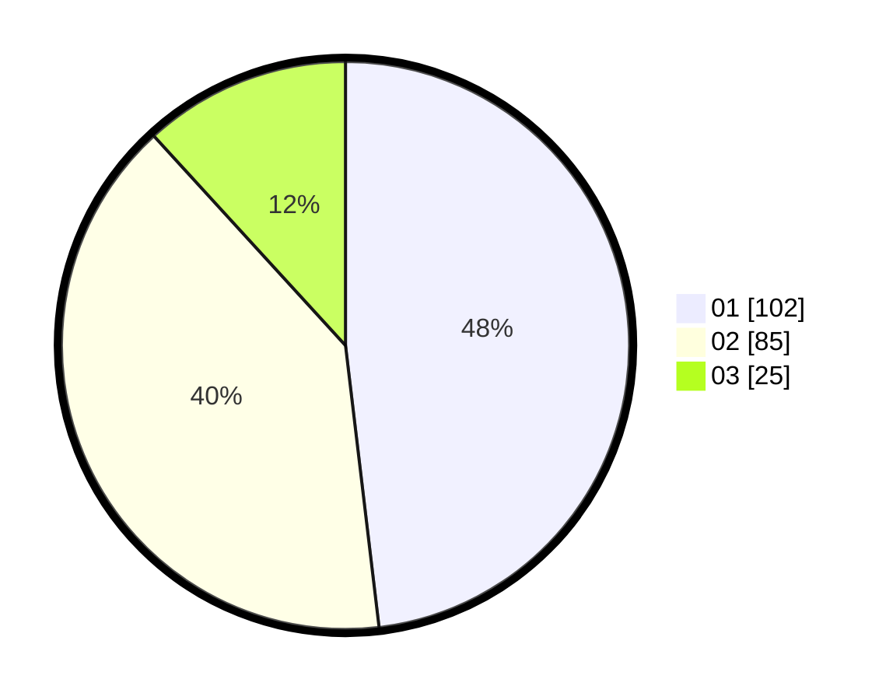

# Hasil

Hasil perolehan suara paslon dapat dilihat pada file paslon-01.txt, paslon-02.txt, dan paslon-03.txt.

Jika tidak ada, artinya data tersebut belum ada pada SIREKAP.

## Perolehan Suara

 * Paslon 01: **102**.
 * Paslon 02: **85**.
 * Paslon 03: **25**.

## Foto C Plano

https://sirekap-obj-formc.kpu.go.id/1ab5/pemilu/ppwp/31/75/03/10/06/3175031006024-20240214-194753--e9fb2569-2882-49c2-9c87-f6c90c4b7486.jpg

https://sirekap-obj-formc.kpu.go.id/1ab5/pemilu/ppwp/31/75/03/10/06/3175031006024-20240214-195200--b4ebfe8b-5df3-4388-a060-5e3ce71d3c9c.jpg

https://sirekap-obj-formc.kpu.go.id/1ab5/pemilu/ppwp/31/75/03/10/06/3175031006024-20240214-192155--bf20f61f-4467-4c11-8604-0dc4da4aaa41.jpg
