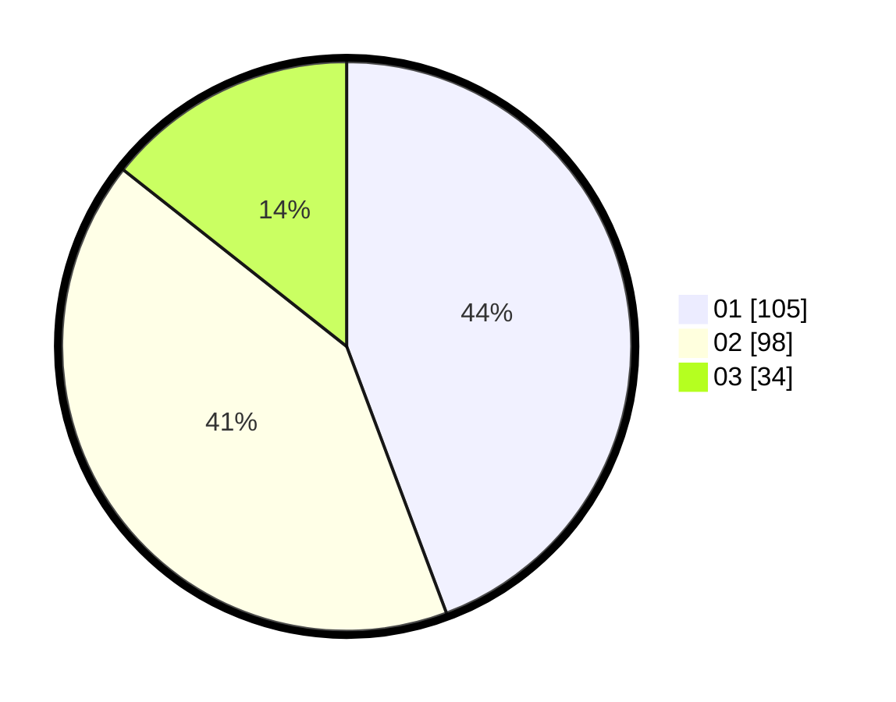

# Hasil

Hasil perolehan suara paslon dapat dilihat pada file paslon-01.txt, paslon-02.txt, dan paslon-03.txt.

Jika tidak ada, artinya data tersebut belum ada pada SIREKAP.

## Perolehan Suara

 * Paslon 01: **105**.
 * Paslon 02: **98**.
 * Paslon 03: **34**.

## Foto C Plano

https://sirekap-obj-formc.kpu.go.id/e5d7/pemilu/ppwp/31/75/03/10/06/3175031006032-20240215-023804--2a26aa03-be2c-47ba-865a-5b84a612c5e6.jpg

https://sirekap-obj-formc.kpu.go.id/e5d7/pemilu/ppwp/31/75/03/10/06/3175031006032-20240215-024017--7348e9aa-ad8b-408d-80aa-793fea8881c2.jpg

https://sirekap-obj-formc.kpu.go.id/e5d7/pemilu/ppwp/31/75/03/10/06/3175031006032-20240215-024156--b0daa2bc-6d4b-4602-901a-cef8fd4c1977.jpg
