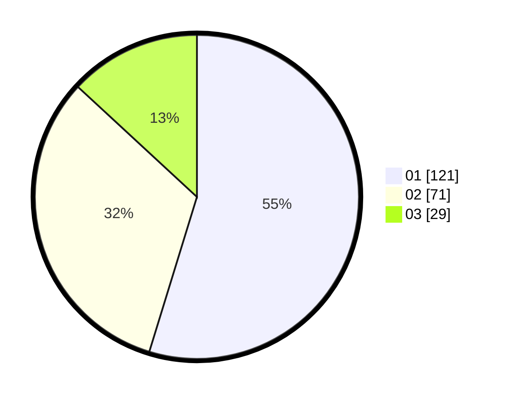

# Hasil

Hasil perolehan suara paslon dapat dilihat pada file paslon-01.txt, paslon-02.txt, dan paslon-03.txt.

Jika tidak ada, artinya data tersebut belum ada pada SIREKAP.

## Perolehan Suara

 * Paslon 01: **121**.
 * Paslon 02: **71**.
 * Paslon 03: **29**.

## Foto C Plano

https://sirekap-obj-formc.kpu.go.id/12c4/pemilu/ppwp/31/75/03/10/06/3175031006044-20240214-185608--f2fe34cc-3c36-4c0a-8723-8317ae045dae.jpg

https://sirekap-obj-formc.kpu.go.id/12c4/pemilu/ppwp/31/75/03/10/06/3175031006044-20240214-191924--79ebf0c2-4770-4387-a15f-16da0e47cb90.jpg

https://sirekap-obj-formc.kpu.go.id/12c4/pemilu/ppwp/31/75/03/10/06/3175031006044-20240214-192137--dcc151eb-bda9-41d7-94e1-505e0ca411a9.jpg

## DATA PEMILIH TETAP

Jumlah pemilih dalam DPT: **284**.
 * L: **150**.
 * P: **134**.

## DATA PENGGUNA HAK PILIH

Jumlah pengguna hak pilih dalam DPT: **223**.
 * L: **114**.
 * P: **109**.

Jumlah pengguna hak pilih dalam DPTb: **1**.
 * L: **0**.
 * P: **1**.

Jumlah pengguna hak pilih dalam DPK: **2**.
 * L: **2**.
 * P: **0**.

Jumlah pengguna hak pilih: **226**.
 * L: **116**.
 * P: **110**.

## JUMLAH SUARA SAH DAN TIDAK SAH

JUMLAH SELURUH SUARA SAH: **221**.

JUMLAH SUARA TIDAK SAH: **5**.

JUMLAH SELURUH SUARA SAH DAN SUARA TIDAK SAH: **226**.
