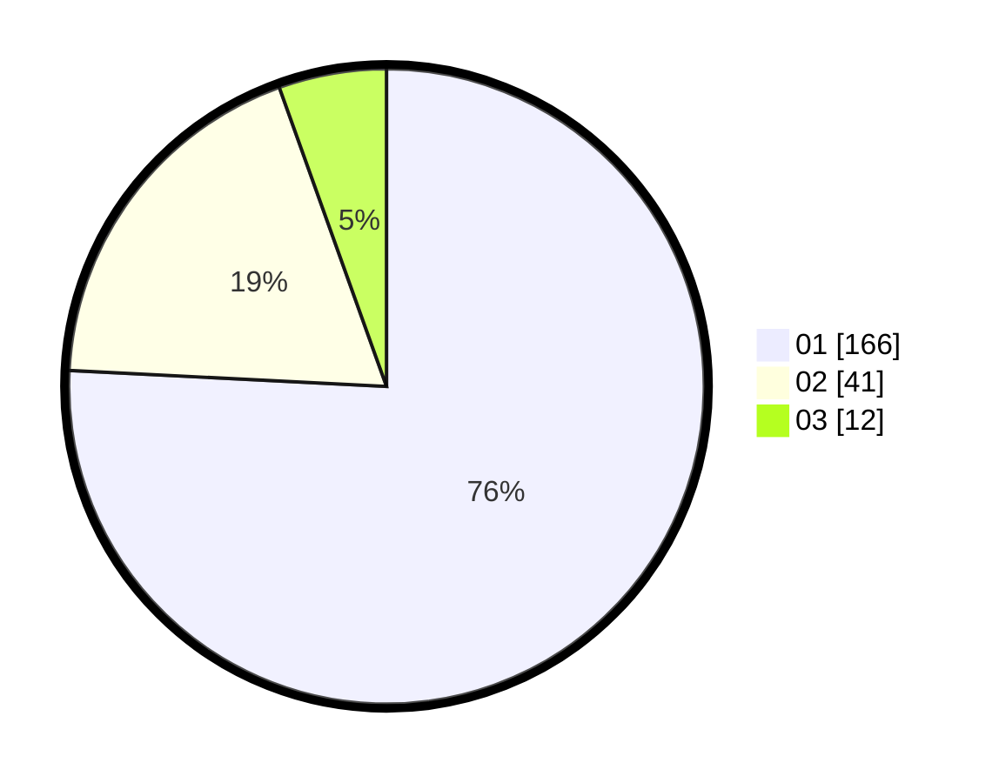

# Hasil

Hasil perolehan suara paslon dapat dilihat pada file paslon-01.txt, paslon-02.txt, dan paslon-03.txt.

Jika tidak ada, artinya data tersebut belum ada pada SIREKAP.

## Perolehan Suara

 * Paslon 01: **166**.
 * Paslon 02: **41**.
 * Paslon 03: **12**.

## Foto C Plano

https://sirekap-obj-formc.kpu.go.id/b6f8/pemilu/ppwp/31/75/03/10/06/3175031006045-20240214-211041--ccf30345-8432-4fc4-9b4a-b7d1fc38e5c5.jpg

https://sirekap-obj-formc.kpu.go.id/b6f8/pemilu/ppwp/31/75/03/10/06/3175031006045-20240214-191717--3bf1bea6-432a-47bc-9cfc-3e890dc8f6f3.jpg

https://sirekap-obj-formc.kpu.go.id/b6f8/pemilu/ppwp/31/75/03/10/06/3175031006045-20240214-191724--947530b8-99ca-4a04-96ff-fd22aa100873.jpg

## DATA PEMILIH TETAP

Jumlah pemilih dalam DPT: **287**.
 * L: **136**.
 * P: **151**.

## DATA PENGGUNA HAK PILIH

Jumlah pengguna hak pilih dalam DPT: **218**.
 * L: **94**.
 * P: **124**.

Jumlah pengguna hak pilih dalam DPTb: **0**.
 * L: **0**.
 * P: **0**.

Jumlah pengguna hak pilih dalam DPK: **2**.
 * L: **1**.
 * P: **1**.

Jumlah pengguna hak pilih: **220**.
 * L: **95**.
 * P: **125**.

## JUMLAH SUARA SAH DAN TIDAK SAH

JUMLAH SELURUH SUARA SAH: **219**.

JUMLAH SUARA TIDAK SAH: **1**.

JUMLAH SELURUH SUARA SAH DAN SUARA TIDAK SAH: **220**.
