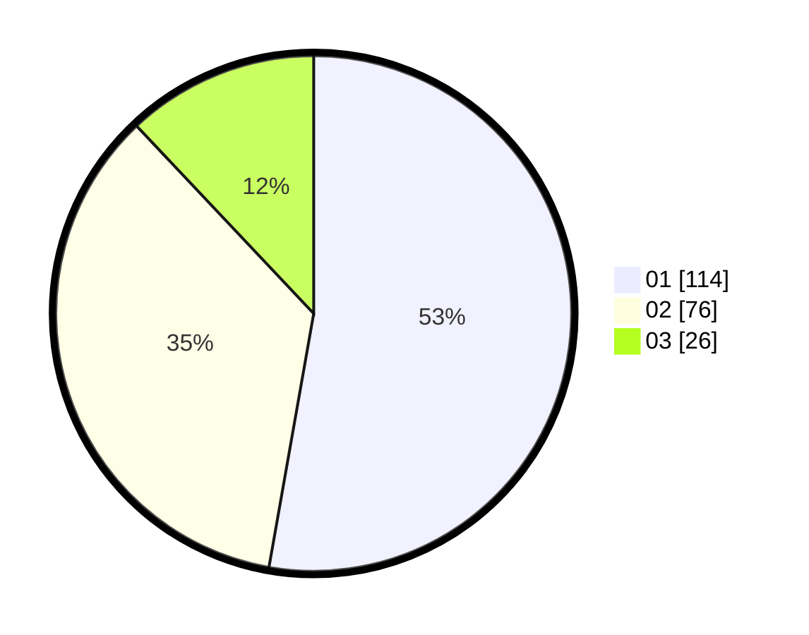

# Hasil

Hasil perolehan suara paslon dapat dilihat pada file paslon-01.txt, paslon-02.txt, dan paslon-03.txt.

Jika tidak ada, artinya data tersebut belum ada pada SIREKAP.

## Perolehan Suara

 * Paslon 01: **114**.
 * Paslon 02: **76**.
 * Paslon 03: **26**.

## Foto C Plano

https://sirekap-obj-formc.kpu.go.id/4a12/pemilu/ppwp/31/75/03/10/06/3175031006050-20240215-075848--04d363b5-bbd1-46a7-92f2-04ec73cbc67c.jpg

https://sirekap-obj-formc.kpu.go.id/4a12/pemilu/ppwp/31/75/03/10/06/3175031006050-20240214-185901--6c16d353-48a6-471f-8f4a-cdf129a4945a.jpg

https://sirekap-obj-formc.kpu.go.id/4a12/pemilu/ppwp/31/75/03/10/06/3175031006050-20240214-190359--a8a42f6b-c1f3-4fcc-aed5-bdbb72aad13d.jpg

## DATA PEMILIH TETAP

Jumlah pemilih dalam DPT: **293**.
 * L: **159**.
 * P: **134**.

## DATA PENGGUNA HAK PILIH

Jumlah pengguna hak pilih dalam DPT: **215**.
 * L: **113**.
 * P: **102**.

Jumlah pengguna hak pilih dalam DPTb: **1**.
 * L: **1**.
 * P: **0**.

Jumlah pengguna hak pilih dalam DPK: **2**.
 * L: **1**.
 * P: **1**.

Jumlah pengguna hak pilih: **218**.
 * L: **115**.
 * P: **103**.

## JUMLAH SUARA SAH DAN TIDAK SAH

JUMLAH SELURUH SUARA SAH: **216**.

JUMLAH SUARA TIDAK SAH: **2**.

JUMLAH SELURUH SUARA SAH DAN SUARA TIDAK SAH: **218**.
