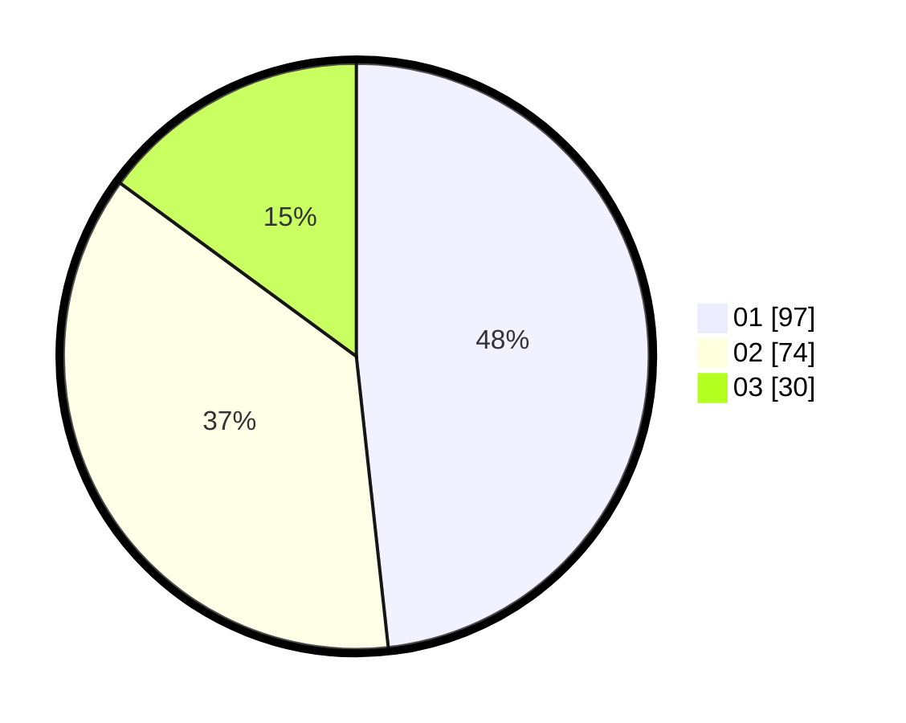

# Hasil

Hasil perolehan suara paslon dapat dilihat pada file paslon-01.txt, paslon-02.txt, dan paslon-03.txt.

Jika tidak ada, artinya data tersebut belum ada pada SIREKAP.

## Perolehan Suara

 * Paslon 01: **97**.
 * Paslon 02: **74**.
 * Paslon 03: **30**.

## Foto C Plano

https://sirekap-obj-formc.kpu.go.id/91bc/pemilu/ppwp/31/75/03/10/06/3175031006052-20240214-231359--08b52c45-73f3-4888-9134-8d7238c42228.jpg

https://sirekap-obj-formc.kpu.go.id/91bc/pemilu/ppwp/31/75/03/10/06/3175031006052-20240214-231513--166339cd-c641-4bcf-bb35-51fddc646130.jpg

https://sirekap-obj-formc.kpu.go.id/91bc/pemilu/ppwp/31/75/03/10/06/3175031006052-20240214-231619--c08db231-f76c-418a-829a-0e0499f2b1dc.jpg
