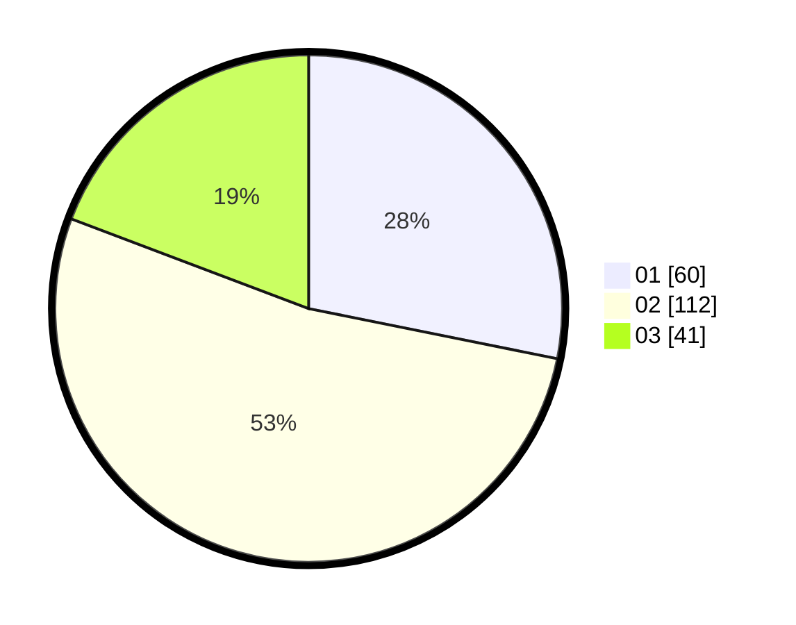

# Hasil

Hasil perolehan suara paslon dapat dilihat pada file paslon-01.txt, paslon-02.txt, dan paslon-03.txt.

Jika tidak ada, artinya data tersebut belum ada pada SIREKAP.

## Perolehan Suara

 * Paslon 01: **60**.
 * Paslon 02: **112**.
 * Paslon 03: **41**.

## Foto C Plano

https://sirekap-obj-formc.kpu.go.id/cb97/pemilu/ppwp/31/75/03/10/06/3175031006060-20240214-190119--f25a22db-c5da-422b-9fac-e5b4b9c84c97.jpg

https://sirekap-obj-formc.kpu.go.id/cb97/pemilu/ppwp/31/75/03/10/06/3175031006060-20240214-185926--60f3610e-1e0c-457a-8f21-27a6831b6815.jpg

https://sirekap-obj-formc.kpu.go.id/cb97/pemilu/ppwp/31/75/03/10/06/3175031006060-20240214-165805--37387a23-3331-4a2a-aabf-209d17a6e530.jpg
