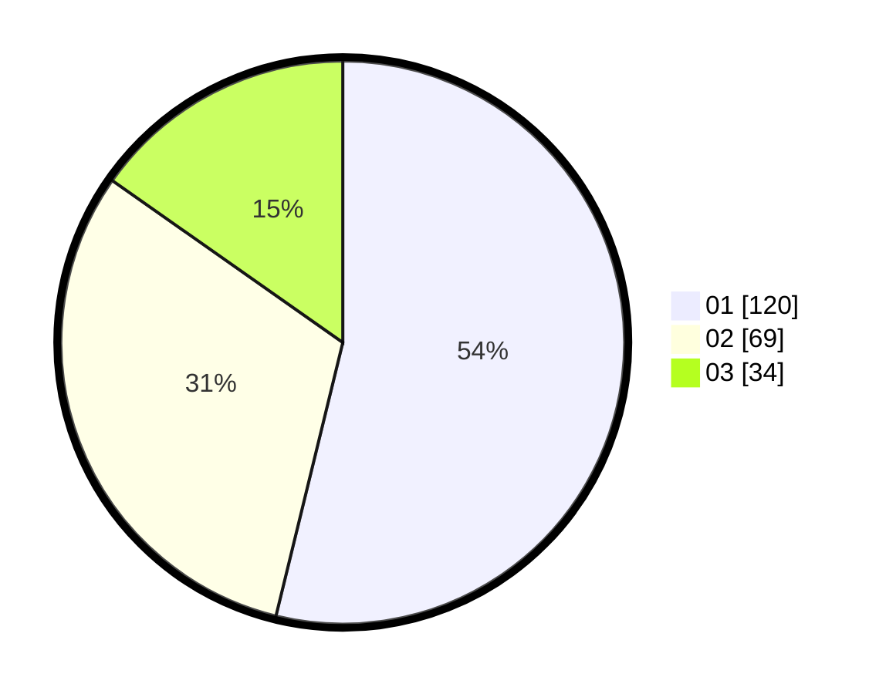

# Hasil

Hasil perolehan suara paslon dapat dilihat pada file paslon-01.txt, paslon-02.txt, dan paslon-03.txt.

Jika tidak ada, artinya data tersebut belum ada pada SIREKAP.

## Perolehan Suara

 * Paslon 01: **120**.
 * Paslon 02: **69**.
 * Paslon 03: **34**.

## Foto C Plano

https://sirekap-obj-formc.kpu.go.id/fb50/pemilu/ppwp/31/75/03/10/06/3175031006061-20240214-231003--e66909c9-a952-43b9-b422-19bfa14de7e3.jpg

https://sirekap-obj-formc.kpu.go.id/fb50/pemilu/ppwp/31/75/03/10/06/3175031006061-20240214-155029--6b75daf8-0492-44cd-87b4-b0b6e9fed8f0.jpg

https://sirekap-obj-formc.kpu.go.id/fb50/pemilu/ppwp/31/75/03/10/06/3175031006061-20240214-232722--bfbed1bf-dd7e-4e0c-bca0-78c1e75255e2.jpg
