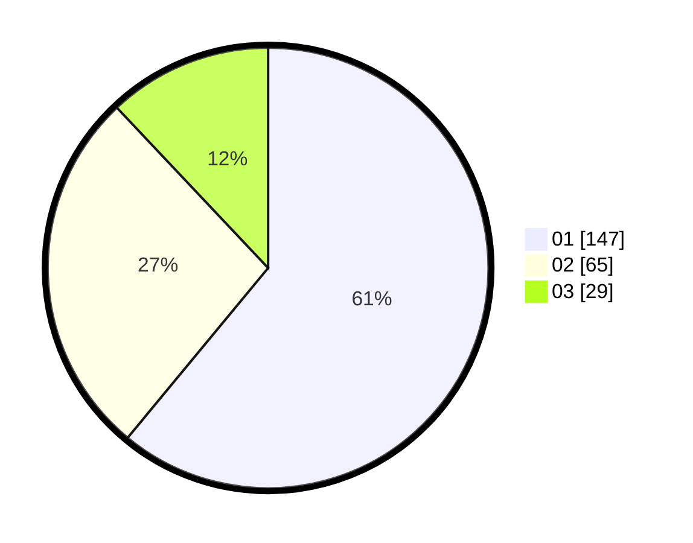

# Hasil

Hasil perolehan suara paslon dapat dilihat pada file paslon-01.txt, paslon-02.txt, dan paslon-03.txt.

Jika tidak ada, artinya data tersebut belum ada pada SIREKAP.

## Perolehan Suara

 * Paslon 01: **147**.
 * Paslon 02: **65**.
 * Paslon 03: **29**.

## Foto C Plano

https://sirekap-obj-formc.kpu.go.id/627a/pemilu/ppwp/31/75/03/10/06/3175031006065-20240216-144211--5f08e1b0-2e84-4a75-be14-b10bf5187350.jpg

https://sirekap-obj-formc.kpu.go.id/627a/pemilu/ppwp/31/75/03/10/06/3175031006065-20240215-201217--b53cb57d-78e6-4555-a462-179eadc95488.jpg

https://sirekap-obj-formc.kpu.go.id/627a/pemilu/ppwp/31/75/03/10/06/3175031006065-20240215-201344--d7a59840-89f8-4578-8833-1f45fd233759.jpg

## DATA PEMILIH TETAP

Jumlah pemilih dalam DPT: **300**.
 * L: **157**.
 * P: **143**.

## DATA PENGGUNA HAK PILIH

Jumlah pengguna hak pilih dalam DPT: **243**.
 * L: **123**.
 * P: **120**.

Jumlah pengguna hak pilih dalam DPTb: **1**.
 * L: **0**.
 * P: **1**.

Jumlah pengguna hak pilih dalam DPK: **0**.
 * L: **0**.
 * P: **0**.

Jumlah pengguna hak pilih: **244**.
 * L: **123**.
 * P: **121**.

## JUMLAH SUARA SAH DAN TIDAK SAH

JUMLAH SELURUH SUARA SAH: **241**.

JUMLAH SUARA TIDAK SAH: **3**.

JUMLAH SELURUH SUARA SAH DAN SUARA TIDAK SAH: **244**.
