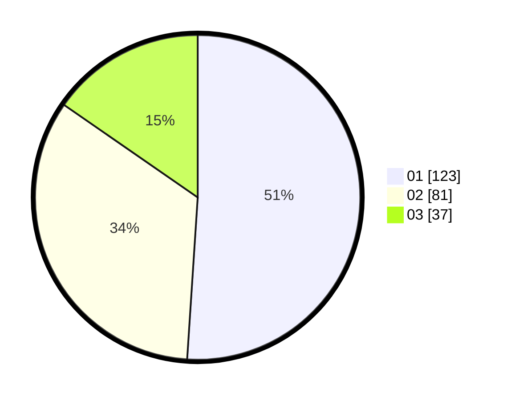

# Hasil

Hasil perolehan suara paslon dapat dilihat pada file paslon-01.txt, paslon-02.txt, dan paslon-03.txt.

Jika tidak ada, artinya data tersebut belum ada pada SIREKAP.

## Perolehan Suara

 * Paslon 01: **123**.
 * Paslon 02: **81**.
 * Paslon 03: **37**.

## Foto C Plano

https://sirekap-obj-formc.kpu.go.id/64f3/pemilu/ppwp/31/75/03/10/06/3175031006068-20240214-191946--25ace139-ea7a-4e1d-92c9-cdf4de064ec5.jpg

https://sirekap-obj-formc.kpu.go.id/64f3/pemilu/ppwp/31/75/03/10/06/3175031006068-20240214-192216--a832f263-5ac0-4cc8-a0df-94f6a0fe0a4c.jpg

https://sirekap-obj-formc.kpu.go.id/64f3/pemilu/ppwp/31/75/03/10/06/3175031006068-20240214-192421--d2b3c32a-96d0-4437-857b-0b9487181774.jpg

## DATA PEMILIH TETAP

Jumlah pemilih dalam DPT: **289**.
 * L: **128**.
 * P: **161**.

## DATA PENGGUNA HAK PILIH

Jumlah pengguna hak pilih dalam DPT: **235**.
 * L: **98**.
 * P: **137**.

Jumlah pengguna hak pilih dalam DPTb: **8**.
 * L: **5**.
 * P: **3**.

Jumlah pengguna hak pilih dalam DPK: **0**.
 * L: **0**.
 * P: **0**.

Jumlah pengguna hak pilih: **243**.
 * L: **103**.
 * P: **140**.

## JUMLAH SUARA SAH DAN TIDAK SAH

JUMLAH SELURUH SUARA SAH: **241**.

JUMLAH SUARA TIDAK SAH: **2**.

JUMLAH SELURUH SUARA SAH DAN SUARA TIDAK SAH: **243**.
