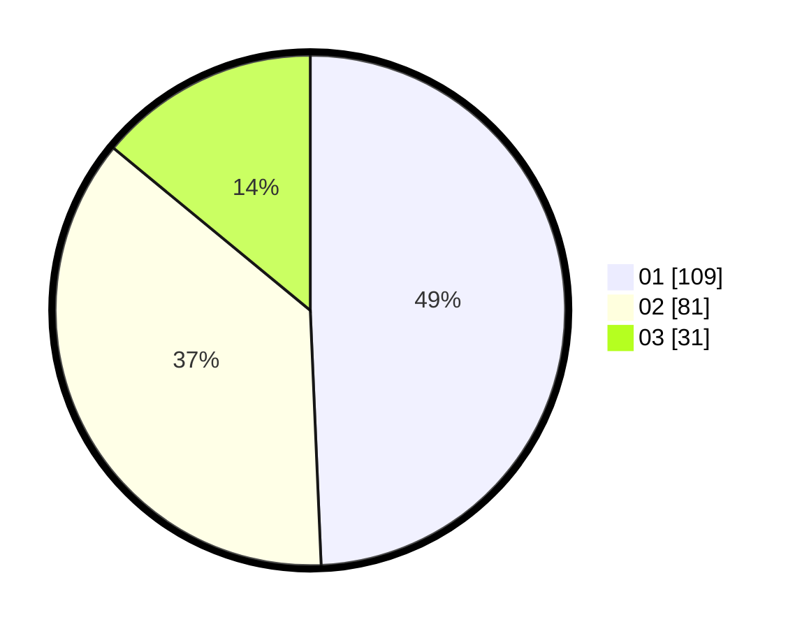

# Hasil

Hasil perolehan suara paslon dapat dilihat pada file paslon-01.txt, paslon-02.txt, dan paslon-03.txt.

Jika tidak ada, artinya data tersebut belum ada pada SIREKAP.

## Perolehan Suara

 * Paslon 01: **109**.
 * Paslon 02: **81**.
 * Paslon 03: **31**.

## Foto C Plano

https://sirekap-obj-formc.kpu.go.id/a2a6/pemilu/ppwp/31/75/03/10/06/3175031006070-20240214-230141--f8aa57c3-d2cf-4f2c-b938-f1dddf58b8f0.jpg

https://sirekap-obj-formc.kpu.go.id/a2a6/pemilu/ppwp/31/75/03/10/06/3175031006070-20240214-230230--3d9645d2-d8d8-4386-a2ed-7cb36f1a2cd9.jpg

https://sirekap-obj-formc.kpu.go.id/a2a6/pemilu/ppwp/31/75/03/10/06/3175031006070-20240214-230320--33fdb0d0-1c39-4dcb-b314-988cd3ef3391.jpg
