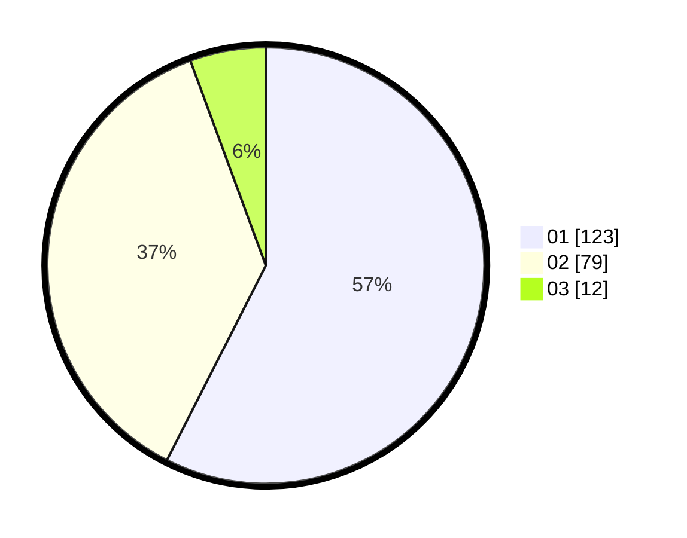

# Hasil

Hasil perolehan suara paslon dapat dilihat pada file paslon-01.txt, paslon-02.txt, dan paslon-03.txt.

Jika tidak ada, artinya data tersebut belum ada pada SIREKAP.

## Perolehan Suara

 * Paslon 01: **123**.
 * Paslon 02: **79**.
 * Paslon 03: **12**.

## Foto C Plano

https://sirekap-obj-formc.kpu.go.id/ab48/pemilu/ppwp/31/75/03/10/06/3175031006071-20240215-011821--d101fa0d-f20b-4830-b1f8-08bf96a82105.jpg

https://sirekap-obj-formc.kpu.go.id/ab48/pemilu/ppwp/31/75/03/10/06/3175031006071-20240215-011901--fa1828b8-d8df-41fa-8c15-6794d2ab3a0b.jpg

https://sirekap-obj-formc.kpu.go.id/ab48/pemilu/ppwp/31/75/03/10/06/3175031006071-20240215-011742--29d69e28-6269-42ef-b68a-5d7c49e42fbf.jpg
