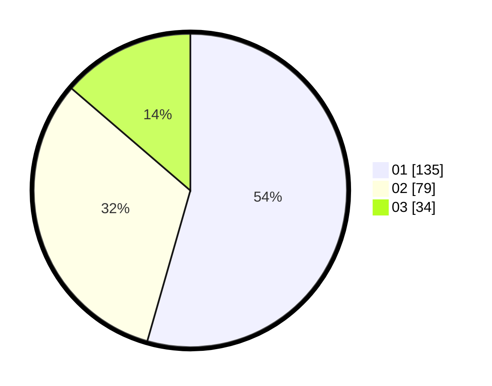

# Hasil

Hasil perolehan suara paslon dapat dilihat pada file paslon-01.txt, paslon-02.txt, dan paslon-03.txt.

Jika tidak ada, artinya data tersebut belum ada pada SIREKAP.

## Perolehan Suara

 * Paslon 01: **135**.
 * Paslon 02: **79**.
 * Paslon 03: **34**.

## Foto C Plano

https://sirekap-obj-formc.kpu.go.id/9d18/pemilu/ppwp/31/75/03/10/06/3175031006073-20240214-193520--090ca6b9-b12d-48e4-b1ec-401d259a03b9.jpg

https://sirekap-obj-formc.kpu.go.id/9d18/pemilu/ppwp/31/75/03/10/06/3175031006073-20240214-192346--585622cf-534d-487e-9263-ba7adf15cf87.jpg

https://sirekap-obj-formc.kpu.go.id/9d18/pemilu/ppwp/31/75/03/10/06/3175031006073-20240214-191431--59b9c495-e593-4087-b11c-94eeabce9827.jpg

## DATA PEMILIH TETAP

Jumlah pemilih dalam DPT: **291**.
 * L: **149**.
 * P: **142**.

## DATA PENGGUNA HAK PILIH

Jumlah pengguna hak pilih dalam DPT: **245**.
 * L: **125**.
 * P: **120**.

Jumlah pengguna hak pilih dalam DPTb: **4**.
 * L: **1**.
 * P: **3**.

Jumlah pengguna hak pilih dalam DPK: **1**.
 * L: **0**.
 * P: **1**.

Jumlah pengguna hak pilih: **250**.
 * L: **126**.
 * P: **124**.

## JUMLAH SUARA SAH DAN TIDAK SAH

JUMLAH SELURUH SUARA SAH: **248**.

JUMLAH SUARA TIDAK SAH: **2**.

JUMLAH SELURUH SUARA SAH DAN SUARA TIDAK SAH: **250**.
