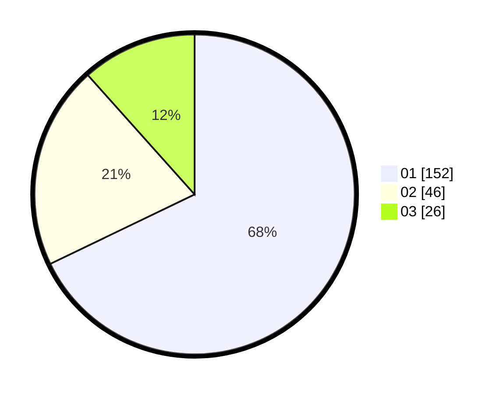

# Hasil

Hasil perolehan suara paslon dapat dilihat pada file paslon-01.txt, paslon-02.txt, dan paslon-03.txt.

Jika tidak ada, artinya data tersebut belum ada pada SIREKAP.

## Perolehan Suara

 * Paslon 01: **152**.
 * Paslon 02: **46**.
 * Paslon 03: **26**.

## Foto C Plano

https://sirekap-obj-formc.kpu.go.id/c18d/pemilu/ppwp/31/75/03/10/06/3175031006074-20240214-202636--66456016-bed3-4b28-bf36-faad45c7504a.jpg

https://sirekap-obj-formc.kpu.go.id/c18d/pemilu/ppwp/31/75/03/10/06/3175031006074-20240214-202717--cd1cd12a-e8d4-46b6-b09e-5d8ff1557e17.jpg

https://sirekap-obj-formc.kpu.go.id/c18d/pemilu/ppwp/31/75/03/10/06/3175031006074-20240214-202744--6c3471c0-7bd1-4b17-9c46-e6e13bfcc578.jpg

## DATA PEMILIH TETAP

Jumlah pemilih dalam DPT: **275**.
 * L: **134**.
 * P: **141**.

## DATA PENGGUNA HAK PILIH

Jumlah pengguna hak pilih dalam DPT: **222**.
 * L: **707**.
 * P: **775**.

Jumlah pengguna hak pilih dalam DPTb: **6**.
 * L: **4**.
 * P: **2**.

Jumlah pengguna hak pilih dalam DPK: **1**.
 * L: **0**.
 * P: **1**.

Jumlah pengguna hak pilih: **229**.
 * L: **111**.
 * P: **178**.

## JUMLAH SUARA SAH DAN TIDAK SAH

JUMLAH SELURUH SUARA SAH: **224**.

JUMLAH SUARA TIDAK SAH: **5**.

JUMLAH SELURUH SUARA SAH DAN SUARA TIDAK SAH: **224**.
