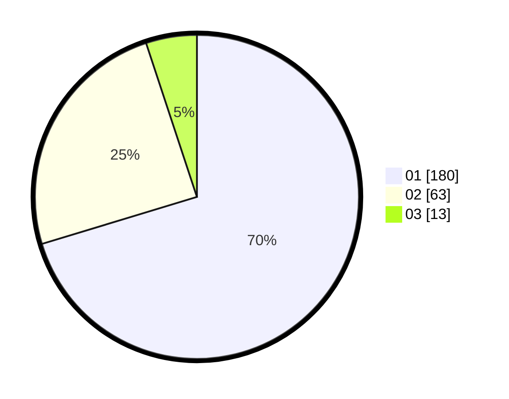

# Hasil

Hasil perolehan suara paslon dapat dilihat pada file paslon-01.txt, paslon-02.txt, dan paslon-03.txt.

Jika tidak ada, artinya data tersebut belum ada pada SIREKAP.

## Perolehan Suara

 * Paslon 01: **180**.
 * Paslon 02: **63**.
 * Paslon 03: **13**.

## Foto C Plano

https://sirekap-obj-formc.kpu.go.id/0ed7/pemilu/ppwp/31/75/03/10/06/3175031006078-20240214-220927--edb1a6dd-8098-4006-9b44-ec043fca9d12.jpg

https://sirekap-obj-formc.kpu.go.id/0ed7/pemilu/ppwp/31/75/03/10/06/3175031006078-20240214-221026--74c00b48-e0b8-4dbe-90be-019241a4c629.jpg
