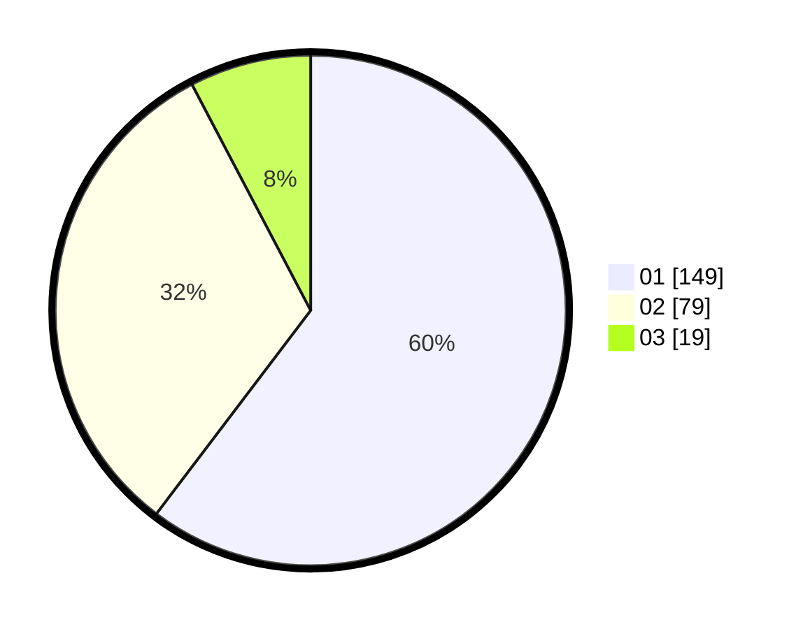

# Hasil

Hasil perolehan suara paslon dapat dilihat pada file paslon-01.txt, paslon-02.txt, dan paslon-03.txt.

Jika tidak ada, artinya data tersebut belum ada pada SIREKAP.

## Perolehan Suara

 * Paslon 01: **149**.
 * Paslon 02: **79**.
 * Paslon 03: **19**.

## Foto C Plano

https://sirekap-obj-formc.kpu.go.id/cac3/pemilu/ppwp/31/75/03/10/06/3175031006081-20240215-015219--f647f5bb-a15e-4f41-9278-8ed0dad67454.jpg

https://sirekap-obj-formc.kpu.go.id/cac3/pemilu/ppwp/31/75/03/10/06/3175031006081-20240215-015251--5a9ff610-812f-4257-bdf4-28152d80ebff.jpg

https://sirekap-obj-formc.kpu.go.id/cac3/pemilu/ppwp/31/75/03/10/06/3175031006081-20240215-015256--5610002a-e6fc-4e1b-8625-ff368ac7fc45.jpg
