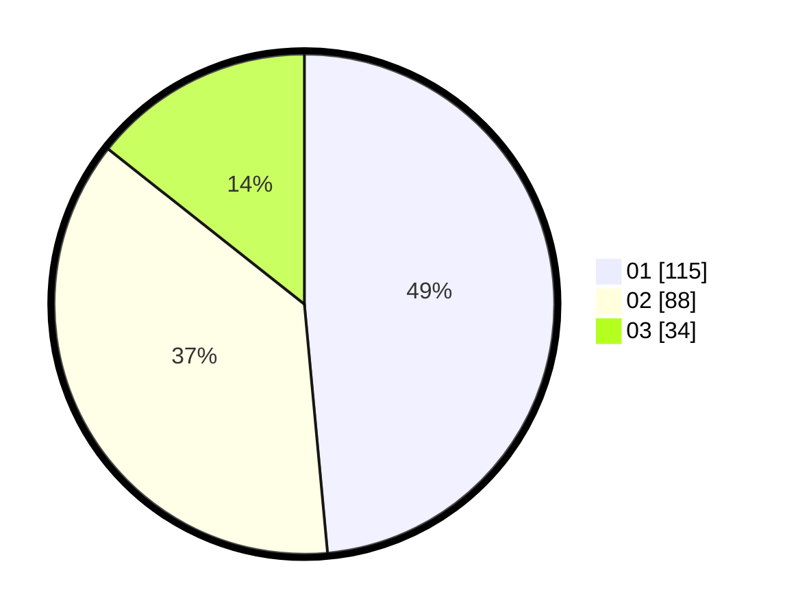

# Hasil

Hasil perolehan suara paslon dapat dilihat pada file paslon-01.txt, paslon-02.txt, dan paslon-03.txt.

Jika tidak ada, artinya data tersebut belum ada pada SIREKAP.

## Perolehan Suara

 * Paslon 01: **115**.
 * Paslon 02: **88**.
 * Paslon 03: **34**.

## Foto C Plano

https://sirekap-obj-formc.kpu.go.id/0ccb/pemilu/ppwp/31/75/03/10/06/3175031006098-20240215-015516--1852d843-eeba-4e19-90f6-3a0c0d0892d1.jpg

https://sirekap-obj-formc.kpu.go.id/0ccb/pemilu/ppwp/31/75/03/10/06/3175031006098-20240215-012026--2105cbe1-014e-4f52-84a6-90e333ea935f.jpg

https://sirekap-obj-formc.kpu.go.id/0ccb/pemilu/ppwp/31/75/03/10/06/3175031006098-20240215-012106--c4f5a3a1-28c5-4001-a126-10757d305558.jpg
