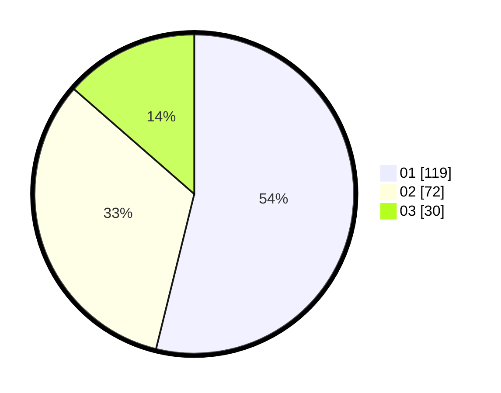

# Hasil

Hasil perolehan suara paslon dapat dilihat pada file paslon-01.txt, paslon-02.txt, dan paslon-03.txt.

Jika tidak ada, artinya data tersebut belum ada pada SIREKAP.

## Perolehan Suara

 * Paslon 01: **119**.
 * Paslon 02: **72**.
 * Paslon 03: **30**.

## Foto C Plano

https://sirekap-obj-formc.kpu.go.id/2be4/pemilu/ppwp/31/75/03/10/06/3175031006099-20240214-204924--7ef560e8-0dcf-490a-9c4c-696feafa129a.jpg

https://sirekap-obj-formc.kpu.go.id/2be4/pemilu/ppwp/31/75/03/10/06/3175031006099-20240214-215259--f9394d15-cac5-417d-a87f-ae78a5c2d3e1.jpg

https://sirekap-obj-formc.kpu.go.id/2be4/pemilu/ppwp/31/75/03/10/06/3175031006099-20240214-190937--b3e2321b-36a0-4fc8-bf73-bc99a1e57c94.jpg

## DATA PEMILIH TETAP

Jumlah pemilih dalam DPT: **289**.
 * L: **147**.
 * P: **142**.

## DATA PENGGUNA HAK PILIH

Jumlah pengguna hak pilih dalam DPT: **224**.
 * L: **111**.
 * P: **113**.

Jumlah pengguna hak pilih dalam DPTb: **0**.
 * L: **0**.
 * P: **0**.

Jumlah pengguna hak pilih dalam DPK: **0**.
 * L: **0**.
 * P: **0**.

Jumlah pengguna hak pilih: **224**.
 * L: **111**.
 * P: **113**.

## JUMLAH SUARA SAH DAN TIDAK SAH

JUMLAH SELURUH SUARA SAH: **221**.

JUMLAH SUARA TIDAK SAH: **3**.

JUMLAH SELURUH SUARA SAH DAN SUARA TIDAK SAH: **224**.
