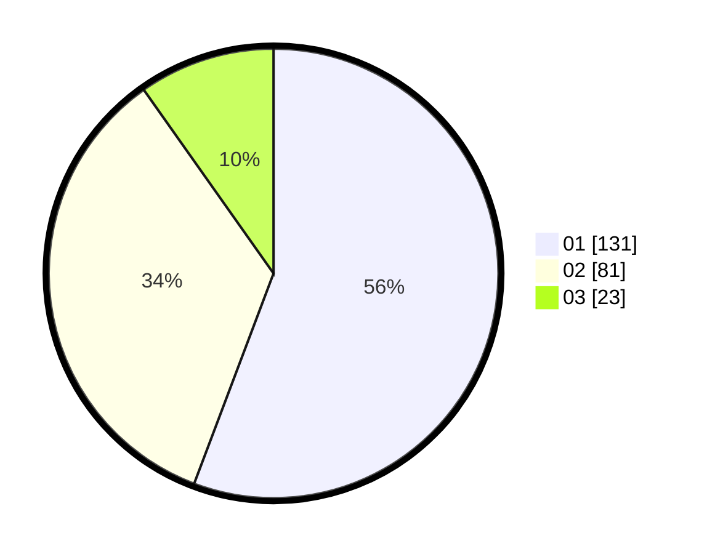

# Hasil

Hasil perolehan suara paslon dapat dilihat pada file paslon-01.txt, paslon-02.txt, dan paslon-03.txt.

Jika tidak ada, artinya data tersebut belum ada pada SIREKAP.

## Perolehan Suara

 * Paslon 01: **131**.
 * Paslon 02: **81**.
 * Paslon 03: **23**.

## Foto C Plano

https://sirekap-obj-formc.kpu.go.id/d0d1/pemilu/ppwp/31/75/03/10/06/3175031006100-20240214-191516--b3d5d724-c075-4e31-bd55-ab81f990267b.jpg

https://sirekap-obj-formc.kpu.go.id/d0d1/pemilu/ppwp/31/75/03/10/06/3175031006100-20240214-200309--8d568f8a-6315-4361-b97f-467c9e5a368b.jpg

https://sirekap-obj-formc.kpu.go.id/d0d1/pemilu/ppwp/31/75/03/10/06/3175031006100-20240214-192013--d32962e5-eb51-4f5d-826d-3fb157e05710.jpg

## DATA PEMILIH TETAP

Jumlah pemilih dalam DPT: **235**.
 * L: **112**.
 * P: **123**.

## DATA PENGGUNA HAK PILIH

Jumlah pengguna hak pilih dalam DPT: **234**.
 * L: **111**.
 * P: **123**.

Jumlah pengguna hak pilih dalam DPTb: **1**.
 * L: **1**.
 * P: **0**.

Jumlah pengguna hak pilih dalam DPK: **0**.
 * L: **0**.
 * P: **0**.

Jumlah pengguna hak pilih: **235**.
 * L: **112**.
 * P: **123**.

## JUMLAH SUARA SAH DAN TIDAK SAH

JUMLAH SELURUH SUARA SAH: **235**.

JUMLAH SUARA TIDAK SAH: **0**.

JUMLAH SELURUH SUARA SAH DAN SUARA TIDAK SAH: **303**.
