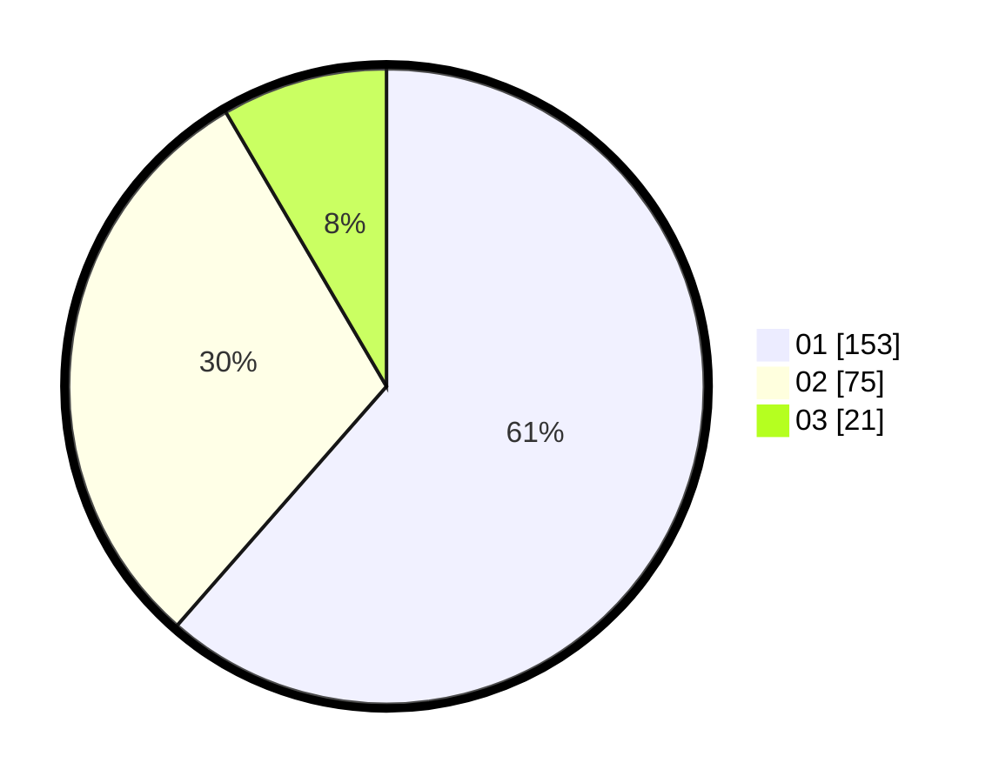

# Hasil

Hasil perolehan suara paslon dapat dilihat pada file paslon-01.txt, paslon-02.txt, dan paslon-03.txt.

Jika tidak ada, artinya data tersebut belum ada pada SIREKAP.

## Perolehan Suara

 * Paslon 01: **153**.
 * Paslon 02: **75**.
 * Paslon 03: **21**.

## Foto C Plano

https://sirekap-obj-formc.kpu.go.id/ac28/pemilu/ppwp/31/75/03/10/06/3175031006101-20240215-010733--cf41ad2d-b72a-4f42-baed-da89c7691a16.jpg

https://sirekap-obj-formc.kpu.go.id/ac28/pemilu/ppwp/31/75/03/10/06/3175031006101-20240215-011114--80916808-774d-422c-b912-11e10b28619b.jpg

https://sirekap-obj-formc.kpu.go.id/ac28/pemilu/ppwp/31/75/03/10/06/3175031006101-20240215-002558--1ba1f1a9-25ef-43e4-a2f5-184c1550009a.jpg

## DATA PEMILIH TETAP

Jumlah pemilih dalam DPT: **295**.
 * L: **141**.
 * P: **154**.

## DATA PENGGUNA HAK PILIH

Jumlah pengguna hak pilih dalam DPT: **247**.
 * L: **114**.
 * P: **133**.

Jumlah pengguna hak pilih dalam DPTb: **0**.
 * L: **0**.
 * P: **0**.

Jumlah pengguna hak pilih dalam DPK: **3**.
 * L: **1**.
 * P: **2**.

Jumlah pengguna hak pilih: **250**.
 * L: **115**.
 * P: **135**.

## JUMLAH SUARA SAH DAN TIDAK SAH

JUMLAH SELURUH SUARA SAH: **249**.

JUMLAH SUARA TIDAK SAH: **1**.

JUMLAH SELURUH SUARA SAH DAN SUARA TIDAK SAH: **250**.
