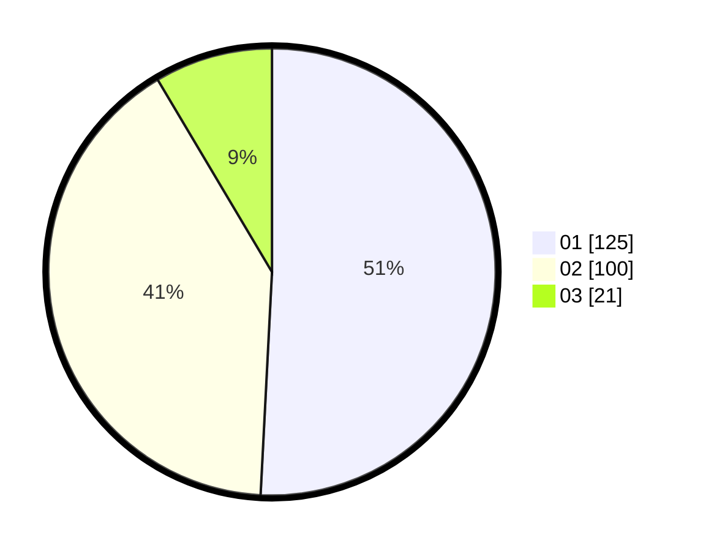

# Hasil

Hasil perolehan suara paslon dapat dilihat pada file paslon-01.txt, paslon-02.txt, dan paslon-03.txt.

Jika tidak ada, artinya data tersebut belum ada pada SIREKAP.

## Perolehan Suara

 * Paslon 01: **125**.
 * Paslon 02: **100**.
 * Paslon 03: **21**.

## Foto C Plano

https://sirekap-obj-formc.kpu.go.id/cfab/pemilu/ppwp/31/75/03/10/06/3175031006105-20240215-192711--8b509114-63a6-4a2c-bb85-b4382cca62c7.jpg

https://sirekap-obj-formc.kpu.go.id/cfab/pemilu/ppwp/31/75/03/10/06/3175031006105-20240215-192734--c94670c5-4233-4e53-9ea6-4d7a8d9de8ca.jpg

https://sirekap-obj-formc.kpu.go.id/cfab/pemilu/ppwp/31/75/03/10/06/3175031006105-20240215-192722--5b1d42ea-e2cf-45a5-a289-189f75dac828.jpg

## DATA PEMILIH TETAP

Jumlah pemilih dalam DPT: **292**.
 * L: **147**.
 * P: **145**.

## DATA PENGGUNA HAK PILIH

Jumlah pengguna hak pilih dalam DPT: **247**.
 * L: **124**.
 * P: **123**.

Jumlah pengguna hak pilih dalam DPTb: **0**.
 * L: **0**.
 * P: **0**.

Jumlah pengguna hak pilih dalam DPK: **2**.
 * L: **0**.
 * P: **2**.

Jumlah pengguna hak pilih: **249**.
 * L: **124**.
 * P: **125**.

## JUMLAH SUARA SAH DAN TIDAK SAH

JUMLAH SELURUH SUARA SAH: **246**.

JUMLAH SUARA TIDAK SAH: **3**.

JUMLAH SELURUH SUARA SAH DAN SUARA TIDAK SAH: **249**.
